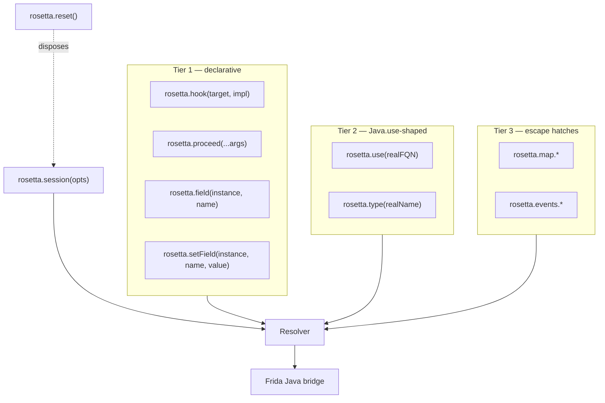

# API overview

rosetta-frida ships one canonical namespace, `rosetta`, with three
intentional tiers. Most hooks live entirely in tier 1. Higher tiers
exist for the cases tier 1 cannot express, never for cases it can.

```typescript
import { rosetta } from 'rosetta-frida';
```

The `rosetta` namespace composes the underlying primitives with an
**ambient session**. You set the session once via `rosetta.session(...)`
and every subsequent call routes through that session's resolver. If
you prefer explicit composition, every function is also available as
a direct import (`use`, `hook`, `createMapApi`, ...) — see
[Advanced composition](#advanced-composition) below.

## The three tiers



| Tier | When to reach for it |
|---|---|
| [Tier 1](tier-1.md) | The default. One-line declarative hook installation, instance field reads/writes from inside a hook body, calling the next implementation in the chain. |
| [Tier 2](tier-2.md) | When tier 1 cannot express something — typically overload disambiguation with mixed real/framework types, static field access on a class wrapper, or building chained method calls (e.g. `Stub.requestTicket.overload(...).implementation = fn`). |
| [Tier 3](tier-3.md) | Tier-3-and-below operations: raw `Java.use(...)` against an obfuscated name, adaptive logic that branches on whether a real name is in the loaded map, runtime overrides, diagnostic event subscription. |

The three tiers share a single Resolver per session. Switching tiers
mid-hook is fine and idiomatic — most non-trivial hooks use a mix.

## Three-tier compositional principle

**Higher tiers never lock you out of lower tiers.** Every tier-1 call
is implementable in tier 2 + tier 3 primitives; every tier-2 call is
implementable in tier 3 + raw `Java.use`. When you find yourself
fighting tier 1, drop one level down and write the hook explicitly.

For example, tier 1's

```typescript
rosetta.hook('Foo.bar', function (x) { return rosetta.proceed(x); });
```

is equivalent to the tier-2 + tier-3 expansion

```typescript
const Foo = rosetta.use('Foo');
Foo.bar
    .overload(/* args from map */)
    .implementation = function (x) { return this.bar(x); };
```

which is in turn equivalent to the raw tier-3 + `Java.use` expansion

```typescript
const m = rosetta.map.resolveMethod('Foo', 'bar');
Java.use(m.className)[m.obfName]
    .overload(/* translated args */)
    .implementation = function (x) { return this.bar.apply(this, arguments); };
```

All three install the same hook. The higher tiers are sugar.

## Sessions

Every tier-1, tier-2, tier-3 call needs a session in scope. You set
the session via:

```typescript
rosetta.session({ map });
```

This call replaces any previously-active ambient session. Calling
tier-1/2/3 surfaces before any `rosetta.session(...)` call throws

```text
no active rosetta session — call rosetta.session({ map }) before using rosetta.*
```

`rosetta.reset()` disposes the ambient session (clearing its diagnostic
bus) so subsequent tier-1/2/3 calls throw that same error again; it is
idempotent. See [`rosetta.reset()` on the Session API
page](session.md#rosettareset-dispose-the-ambient-session) for when to
reach for it.

See the [Session API page](session.md) for the full
`SessionOptions` surface (auto-detect overrides, failure policy,
version match mode, health check controls, trace mode).

## Advanced composition

If you prefer explicit dependency injection — for example, you want
two sessions in one script targeting two different apps — bypass the
ambient namespace and use the underlying functions directly:

```typescript
import {
    createSession,
    use,
    hook,
    createMapApi,
    createEventsApi,
} from 'rosetta-frida';

const sessionA = createSession({ map: mapA });
const sessionB = createSession({ map: mapB });

// Tier 2 against session A:
const Stub = use('com.example.app.IRemoteService$Stub', {
    resolver: sessionA.resolver,
});

// Tier 1 against session B:
hook(
    'com.example.app.IRemoteService$Stub.requestTicket',
    function (b, c) { return this.requestTicket(b, c); },
    { resolver: sessionB.resolver },
);

// Tier 3 — bound to a session each:
const mapA_api = createMapApi(sessionA);
const eventsB = createEventsApi(sessionB);
```

Each function takes `{ resolver }` (tier 1, tier 2) or a session
(`createMapApi`, `createEventsApi`) explicitly. The `rosetta`
namespace is sugar that closes over a single ambient session.

V1 ships only the single-ambient-session form on the namespace.
Multi-session scripts must use the explicit composition above.

## Symbol cheatsheet

Every exported name from `rosetta-frida`, grouped:

| Symbol | Kind | Where to read |
|---|---|---|
| `rosetta` | Object | This page; [tier-1](tier-1.md), [tier-2](tier-2.md), [tier-3](tier-3.md) |
| `createSession`, `RosettaSession` | Function, class | [Session](session.md) |
| `detectAppAndVersion`, `pickMapForVersion`, `runHealthCheck`, `DEFAULT_HEALTH_CHECK_THRESHOLD` | Function, constant | [Session](session.md) |
| `use`, `type` | Function | [Tier 2](tier-2.md) |
| `hook`, `proceed`, `field`, `setField` | Function | [Tier 1](tier-1.md) |
| `createMapApi`, `createEventsApi` | Function | [Tier 3](tier-3.md) |
| `makeClassProxy`, `makeMethodHandle`, `makeFieldAccessor`, `makeInstanceProxy` | Function | [Tier 3](tier-3.md), [proxy types](../reference/types.md#proxy-types) |
| `createResolver`, `ResolverImpl`, `makeSentinel`, `isSentinel` | Function, class | [Tier 3](tier-3.md), [design](../reference/design.md#resolver) |
| `loadMap`, `parseJson`, `looksLikeJsonSource` | Function | [Maps — format](../maps/format.md) |
| `validateMap`, `rosettaMapSchema` | Function, schema | [Maps — format](../maps/format.md) |
| `yamlToMap`, `convertToJson`, `renderJson` | Function | [Maps — conversion](../maps/conversion.md) |
| `BEGIN_MARKER`, `END_MARKER`, `BEGIN_REGISTRY`, `END_REGISTRY`, `MARKER_REGEX`, `emitMarkerBlock`, `emitMarkerRegistry`, `parseMarkerBlock`, `patchMarkerBlock` | Constants, function | [Marker block](../maps/marker-block.md) |
| `EventBus`, `formatEvent`, `createSilentBus` | Class, function | [Events reference](../reference/events.md) |
| `RosettaError`, `ResolveError`, `AmbiguousOverloadError`, `MapValidationError`, `JsonParseError`, `MapVersionMismatchError`, `HealthCheckFailedError`, `MarkerBlockError`, `UnresolvedAccessError` | Error classes | [Errors](../reference/errors.md) |

All [type aliases](../reference/types.md) are also re-exported from
the package root.
