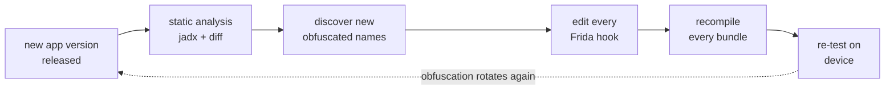
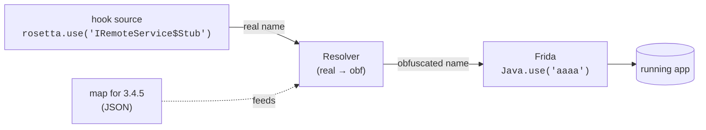
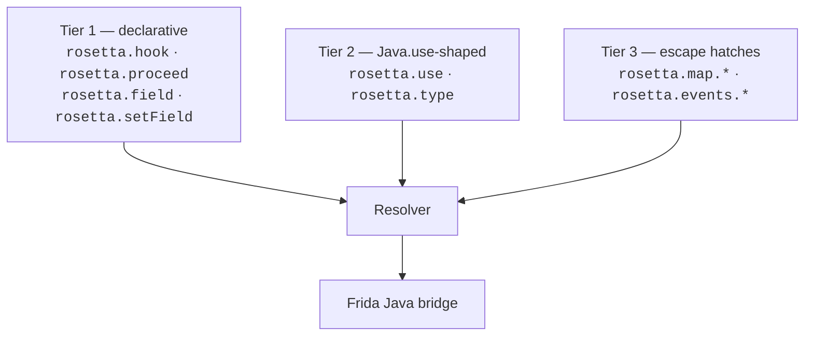

# Concepts

The vocabulary you need to read the rest of these docs, and the
mental model that makes rosetta-frida feel obvious instead of magical.

## The rotation problem

Large commercial Android apps run their release builds through an
obfuscator (R8 / ProGuard / DexGuard / commercial equivalents). The
obfuscator rewrites internal class, method, and field names to short,
information-free tokens — `aaaa`, `bbbb`, `c`, `f` — to shrink the
APK and frustrate reverse engineers.

This rewriting is **not stable across releases.** Between two
adjacent point releases of the same app, you will commonly observe:

- A class anchor that was named `aaaa` in `3.4.5` is now named
  `aaab` in `3.5.0` — same logical class, new short name.
- A *different* class that was named `aaab` is now `aacd` — every
  rotation cascades.
- Method letters inside a class are often more stable than the class
  names themselves — `aaaa.c` and `aaab.c` may be the same method
  after a rotation.

Today the recovery loop when an app version ships is:



That is the cycle rosetta-frida exists to break.

## Real vs obfuscated names

A **real name** is the name a class, method, or field has in the
source code — what the developer typed. `IRemoteService$Stub`,
`requestTicket`, `sessionId`.

An **obfuscated name** is what the running app actually uses after
the build's obfuscator ran. `aaaa`, `c`, `a`.

Real names survive obfuscation only in your head, in jadx output, in
class signatures of public AIDL stubs, and in error messages the app
emits at runtime. The on-device DEX bytecode has only obfuscated
names.

rosetta-frida is a translation layer between these two worlds. You
write hooks against real names. A per-version **map** describes the
real → obfuscated translation. At Frida-attach time the runtime
loads the map, picks the right entry for the running app version,
and serves your hook's calls.



## Sessions

A **session** is the runtime state that ties together a map, a
detected app, a detected version, and a Resolver. You open one with
`rosetta.session({ map })` — typically once per `Java.perform`.

The session does five things at construction:

1. Resolve `(app, version)` — either from the user-supplied
   `app`/`version` options, or by auto-detecting in-process via
   `ActivityThread.currentApplication().getApplicationContext()
   .getPackageManager().getPackageInfo(...)`.
2. Pick a map. If you passed a `RosettaMap`, use it directly. If you
   passed a `RosettaMapRegistry` (a record of `version → RosettaMap`),
   select the right entry by version, with optional fuzzy fallback.
3. Verify `(app, version)` matches the loaded map. Mismatch →
   `MapVersionMismatchError`.
4. Run the **attach-time health check** — verify the map matches the
   running app well enough to trust by calling `Java.use(obfName)` on
   every mapped class.
5. Build a Resolver bound to the map and the session's diagnostic
   bus.

After that, every `rosetta.use(...)`, `rosetta.hook(...)`,
`rosetta.map.resolveClass(...)`, etc., consults the session's
resolver.

See [Session API](../api/session.md) for the full surface.

## Maps

A **map** is a single strict-JSON file describing the real → obfuscated
translation for one `(app, version)` pair. The on-disk format:

```json
{
    "schema_version": 2,
    "app": "com.example.app",
    "version": "3.4.5",
    "version_code": 30405,
    "captured_at": "2026-05-13",
    "classes": {
        "com.example.app.IRemoteService$Stub": {
            "obfuscated": "aaaa",
            "kind": "aidl_stub",
            "methods": {
                "requestTicket": {
                    "obfuscated": "c",
                    "signature": "(Landroid/os/Bundle;Lbbbb;)V"
                }
            }
        }
    }
}
```

Each class is keyed by its **real fully-qualified name** and carries
the obfuscated short name plus methods, fields, and optional metadata
(parent class, AIDL descriptor, DEX shard, anchor strings,
provenance).

YAML is supported as an authoring input via the
[`rosetta convert`](../cli/convert.md) CLI; TS/JS inputs are not
supported. Strict JSON is the canonical on-disk and on-wire format.

See [Maps — format reference](../maps/format.md) for every field.

## Anchoring — how a map entry survives rotation

A map entry says "real name `X` is obfuscated as `aaaa` in this
version." But `aaaa` is a moving target: next release it might name a
completely different class. An **anchor** is the obfuscation-stable
property that ties the entry back to the *right* class even as the short
name rotates — and it's what the [health check](#sessions) verifies at
attach time.

The reason anchoring works at all: an obfuscator rewrites **names**, but
it leaves **data** and **framework bindings** alone. So the durable
anchors are the things that are *not* names:

- **A stable string literal the class embeds.** An algorithm name like
  `"AES/GCM/NoPadding"`, a log tag, a JSON key, a URL path — the
  developer wrote it as data, so it rides through rotation untouched. Set
  it in the entry's `anchors`. This is the **default, most broadly
  applicable** anchor: it works even for a deep internal class that
  exposes no public API at all. See
  [Recipe — string-anchored class](../recipes/string-anchored-class.md).
- **A stable framework parent.** A class that extends
  `android.app.JobService` or implements `java.lang.Runnable` keeps that
  parent across rotations, because the framework type is not part of the
  app and is not obfuscated. Pin the subclass by its parent via
  `extends`. See
  [Recipe — superclass-anchored method](../recipes/superclass-anchored-method.md).
- **An AIDL descriptor — the lucky special case.** *If* the class is an
  AIDL stub, it carries a stable `DESCRIPTOR` string and transaction
  codes that make a particularly strong anchor (`kind: aidl_stub`,
  `aidl_descriptor`, `aidl_txn`). But most classes are not AIDL stubs, so
  this is a bonus when it applies — not the plan you start from. See
  [Recipe — AIDL stub hooks](../recipes/aidl-stub-hook.md).

Think generic first (string / superclass), and reach for AIDL only when
the class happens to give it to you.

## The marker block

The compiled bundle wraps the embedded map in a PEM-style marker
block:

```js
/*! -----BEGIN ROSETTA MAP----- */
/*! app: com.example.app | version: 3.4.5 | schema: 2 | classes: 15 */
const __rosetta_map = {
    "schema_version": 2,
    "app": "com.example.app",
    "version": "3.4.5",
    "version_code": 30405,
    "classes": { /* ... */ }
};
/*! -----END ROSETTA MAP----- */
```

This makes the embedded map locatable and replaceable in the compiled
bundle without re-running `frida-compile`. Three CLI commands use it:

- [`rosetta inspect`](../cli/inspect.md) — print a one-line summary.
- [`rosetta extract`](../cli/extract.md) — pull the embedded map back
  out into a standalone JSON file.
- [`rosetta patch`](../cli/patch.md) — replace the embedded map in
  place. Used in CI to swap maps without recompiling the hook.

The `/*! ... */` block-comment convention persuades minifiers
(terser, esbuild) to preserve the markers as "important" comments.
See [Marker block reference](../maps/marker-block.md) for the full
spec.

## The three API tiers

The API has three intentional tiers. Most hooks live entirely in
tier 1. Higher tiers exist for the cases tier 1 can't express, never
for cases it can.



- [Tier 1](../api/tier-1.md) — declarative one-liners. The default.
- [Tier 2](../api/tier-2.md) — `Java.use`-shaped surface, for users
  comfortable with Frida's idiom who want name translation without
  giving up the `Klass.method.overload(...).implementation = fn`
  shape.
- [Tier 3](../api/tier-3.md) — raw resolver queries, diagnostic
  event subscription, runtime overrides. The "I know what I'm doing"
  layer.

See [API overview](../api/overview.md) for guidance on which to
reach for.

## Failure policy

Two values: `strict` and `warn`. The session-level default is
`warn`.

| Policy | Behavior on unresolved real name |
|---|---|
| `strict` | Throw `ResolveError` immediately at the call site. |
| `warn` | Log a warning event and return a sentinel that throws clearly only when actually used. |

`strict` is best for CI (any miss is a hard fail; the build breaks).
`warn` is best for production / field deployments (a miss in one
hook doesn't take down the rest of the script).

V1 has only these two. A `discover` policy that runs runtime
discovery strategies arrives in V2.

## Where to next

- [Quick start](quick-start.md) — the smallest end-to-end hook.
- [API overview](../api/overview.md) — pick your tier.
- [Sample hook walkthrough](../recipes/aidl-stub-hook.md) — annotated
  tour of the canonical example.
- [Design](../reference/design.md) — the four-subsystem architecture
  and how it composes.
