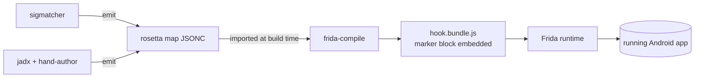

# rosetta-frida

**Translate real (unobfuscated) Java class, method, and field names to
the per-version obfuscated names your target app actually uses — at
Frida-attach time.**

Write one hook. Ship a map per release. Stop rewriting Frida scripts
every time the obfuscator rotates.

<div class="grid cards" markdown>

-   :material-rocket-launch: __Write once__

    ---

    Hooks reference real names. The library translates to obfuscated
    names through a per-version map loaded at attach time. The same
    source compiles unchanged across every app version that has a
    matching map.

-   :material-database: __Per-version maps__

    ---

    On-disk JSONC — human-readable, comment-supporting, machine-
    round-trippable. Supports YAML and TypeScript-module input formats
    via a CLI converter.

-   :material-shield-check: __Health-checked at attach__

    ---

    Before your hooks run, rosetta verifies the loaded map matches the
    running app (package, version, class lookups, AIDL descriptors,
    anchor strings). Wrong-map disasters surface as a single readable
    error, not a cascade of nulls.

-   :material-tools: __CLI included__

    ---

    `rosetta init`, `validate`, `convert`, `patch`, `extract`,
    `inspect` — scaffold maps, swap them into compiled bundles, and
    audit what every bundle actually targets.

</div>

## The 30-second pitch

```typescript
import { rosetta, type RosettaMap } from 'rosetta-frida';
import sampleMap from './maps/com.example.app/3.4.5.json' with { type: 'json' };

const map = sampleMap as unknown as RosettaMap;

Java.perform(() => {
    // Open a session. Auto-detects the running app + version,
    // validates them against the loaded map, runs a health check.
    rosetta.session({ map });

    // Hook by real name. rosetta translates to the obfuscated name
    // (e.g. `aaaa.c`) under the hood.
    rosetta.hook(
        'com.example.app.IRemoteService$Stub.requestTicket',
        function (bundle, callback) {
            send({ stage: 'requestTicket', keys: bundle.keySet() });
            return rosetta.proceed(bundle, callback);
        },
    );
});
```

When the obfuscator rotates `aaaa → aaab` in the next release, you do
not change a single line of the hook. You ship a new map for `3.5.0`
and the same script targets the new version.

## Why this exists

Large commercial Android apps rotate obfuscation on every minor
release. The class anchors that worked for `1.2.x` do not survive
`1.3.x`. The method letters inside often stay stable — but the class
names at the left side of the table rotate, breaking every hook in
the field.

Today the recovery loop is:

1. Static-analysis pass (jadx + diff against the previous version) to
   discover the new obfuscated names.
2. Patch every Frida script that hard-codes those names.
3. Re-compile every bundle.
4. Re-test on a device.

rosetta-frida decouples *what we want to hook* (real name) from *how
it is spelled today* (obfuscated name) by introducing per-version
mapping files and a lookup layer that consults them at attach time.

See [Concepts](getting-started/concepts.md#the-rotation-problem) for
the full motivating story.

## What's in V1.0

- **Three-tier API.**
  [Tier 1](api/tier-1.md) is the declarative `rosetta.hook(...)` and
  `rosetta.field(...)` shorthand for the common 90% of hooks.
  [Tier 2](api/tier-2.md) is the `Java.use`-shaped surface for users
  who want the familiar `Klass.method.overload(...).implementation = fn`
  shape with name translation.
  [Tier 3](api/tier-3.md) is the low-level escape hatch:
  `rosetta.map.resolveClass(...)`, `rosetta.events.on(...)`,
  runtime overrides.
- **Session lifecycle.** In-process auto-detect of app + version,
  registry-bundle picking with optional fuzzy fallback, attach-time
  health check.
- **JSONC maps with comments.** YAML and TypeScript modules supported
  via `rosetta convert`.
- **PEM-style marker block.** Maps embed into the compiled bundle
  between `-----BEGIN ROSETTA MAP-----` / `-----END ROSETTA MAP-----`
  comments. Swap maps without recompiling via `rosetta patch`.
- **CLI tooling.** `init`, `validate`, `convert`, `patch`, `extract`,
  `inspect`.
- **Sample map and sample hook.** A 15-class anonymized example map
  covering AIDL stubs, callbacks, overloads, fields, enums, anonymous
  inner classes.
- **595 tests, 100% coverage.** Every line of the runtime exercised.

What is **not** in V1.0:

- Runtime self-healing / discovery (deferred to V2).
- A public maps repo (deferred to V2; V1 ships example maps in-repo).
- `rosetta diff`, `merge`, `migrate`, `types`, `verify`, `fetch`,
  `merge-bundle` CLI commands (deferred to V1.5).
- Native (JNI / ELF symbol) mapping (deferred to V2+).

See [Changelog](changelog.md) for the full V1.0 changelog and
[Design — V1 MVP scope](reference/design.md#v10-mvp-scope) for the
roadmap.

## Getting started

[Install rosetta-frida :material-arrow-right:](getting-started/installation.md){ .md-button .md-button--primary }
[Read the quick start :material-arrow-right:](getting-started/quick-start.md){ .md-button }

## Where this fits



rosetta-frida is the consumer of maps. It does not analyze APKs
(sigmatcher does that). It does not replace Frida (your existing
controller — Python `frida`, `frida` CLI, `frida-node` — loads the
compiled bundle unchanged).
