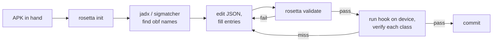

# Authoring maps

You have an Android app you want to hook. You have an APK and a fresh
copy of jadx (or sigmatcher, or both). You want a working map for
the running version. This page walks through the workflow.

## Workflow at a glance



The loop is: scaffold → discover → edit → validate → verify on
device → commit. Each iteration adds a few classes; you typically
do **not** try to enumerate the whole app's surface up front.

## 1. Scaffold

```sh
npx rosetta init com.example.app 3.4.5
```

This writes `maps/com.example.app/3.4.5.json` — a strict-JSON skeleton
with header comments documenting each field, all top-level metadata
filled in, an empty `classes: {}`, and a single commented-out example
entry to copy-paste from.

By default the path is `maps/<app>/<version>.json`. Override with
`-o <path>`:

```sh
npx rosetta init com.example.app 3.4.5 -o vendor/maps/example-3.4.5.json
```

Pass `--force` if the file already exists and you want to overwrite.

See [CLI — `rosetta init`](../cli/init.md) for the full reference.

## 2. Discover obfuscated names

How you get from real names to obfuscated names is **out of scope
for rosetta-frida** — the library consumes maps, it doesn't produce
them. Three common sources:

### sigmatcher (automated)

[sigmatcher](https://github.com/0xKD/sigmatcher) matches each class
in your APK against a signature library you build up over time. It
emits a `rosetta-frida`-compatible map directly. Best for keeping
maps fresh across releases — once you've signature-matched a class
once, the signature usually survives obfuscation rotation.

### jadx (manual)

For a one-off, open the APK in jadx, search for distinctive class
features (AIDL descriptors, stable string literals, AIDL transaction
codes), and copy the obfuscated class names out by hand.

Distinctive features to anchor on, in rough order of stability:

1. **AIDL `DESCRIPTOR` constant.** AIDL stubs have a stable
   `public static final String DESCRIPTOR = "com.example.app.IFoo"`
   that survives obfuscation. Search for the descriptor string, find
   the holder class, and you've found the stub.
2. **Stable string literals.** Error messages, logging tags, JSON
   keys that the developer wrote. Search the dex for the string;
   the containing class is your candidate.
3. **AIDL transaction codes.** `TRANSACTION_xxx = 1`, `2`, `3`. Less
   stable than descriptors but still anchor a class roughly.
4. **Class hierarchy.** "Extends `android.os.Binder`" narrows the
   search space for stub-like classes.

### hand-author from a Frida runtime trace

When sigmatcher and jadx don't reach (e.g. a class that's only
loaded after a network response), attach Frida, log the runtime
class graph as the relevant code path executes, and hand-author the
mapping from the trace output. This is the "verified via Frida
runtime trace" path you see in many `MapSource.notes`.

## 3. Fill the JSON entries

Open the file and replace the example with real classes:

```json
{
    "schema_version": 2,
    "app": "com.example.app",
    "version": "3.4.5",
    "version_code": 30405,
    "captured_at": "2026-05-13",
    "sources": [
        { "tool": "sigmatcher", "config": "signatures/example.json", "classes": 12 },
        { "tool": "hand-authored", "classes": 3, "notes": "verified on emulator" }
    ],
    "classes": {
        "com.example.app.IRemoteService$Stub": {
            "obfuscated": "aaaa",
            "kind": "aidl_stub",
            "aidl_descriptor": "com.example.app.IRemoteService",
            "source": "sigmatcher",
            "methods": {
                "requestTicket": {
                    "obfuscated": "c",
                    "signature": "(Landroid/os/Bundle;Lbbbb;)V",
                    "aidl_txn": 2
                }
            }
        }
    }
}
```

### Tips for filling entries

**Start with the AIDL stubs.** They have the most stable anchors
(`aidl_descriptor`, `aidl_txn`) and they're usually the hooks you
care about most.

**Add `aidl_descriptor` always.** The health check uses it. Even if
you never use the AIDL transaction codes, the descriptor catches
"wrong class assigned to this real name" errors at attach time.

**Use the overload-array form only when you need to.** Most methods
have one overload in the map; the single-form is cleaner. Switch to
the array form (`"foo": [ { ... }, { ... } ]`) only when one real
name has multiple obfuscated entries.

**Include cross-class type refs in signatures.** When a method takes
or returns a mapped class, the signature uses its obfuscated name
(`Lbbbb;` not `Lcom/example/app/IServiceCallback;`). This is what
Frida ultimately needs; the resolver translates between them.

**Add `anchors` for high-confidence classes.** Stable string literals
embedded in a class become anchor checks at attach time — catching
"wrong class assigned" errors with a lower false-positive rate than
the AIDL-descriptor check alone.

## 4. Validate

```sh
npx rosetta validate maps/com.example.app/3.4.5.json
```

Success:

```text
OK: maps/com.example.app/3.4.5.json — com.example.app@3.4.5, 15 class(es), schema_version=1
```

Failure surfaces specific issues:

```text
FAIL: maps/com.example.app/3.4.5.json — invalid map
  at classes.com.example.app.Foo.obfuscated: required
  at classes.com.example.app.Bar.methods.baz.signature: must match /\(.*\)[^()]+/
```

Run validate before every commit. It catches typos and missing
fields long before the map ships to a device.

See [CLI — `rosetta validate`](../cli/validate.md) for the full
reference, including the YAML and TS-module input formats.

## 5. Verify on device

Validation only checks the file shape. To check the map *matches the
running app*, attach to the device:

```sh
npx frida-compile hook.ts -o hook.bundle.js
frida -U -l hook.bundle.js com.example.app
```

The attach-time **health check** iterates every class in the map and
verifies `Java.use(obfName)` succeeds, the AIDL descriptor matches,
and any `anchors` strings are present. With `trace: true` in the
session options:

```text
[rosetta] map-load com.example.app@3.4.5 schema=1 classes=15
[rosetta] health-check PASS rate=100.0% threshold=80.0% failures=0
```

A failed check tells you which class entries are wrong:

```text
[rosetta] health-check FAIL rate=80.0% threshold=80.0% failures=3
```

Subscribe programmatically to see the failed entries:

```typescript
rosetta.events.onType('health-check', (e) => {
    if (!e.passed) {
        send({ failed: e.failedEntries });
    }
});
```

For each failed entry, recheck:

1. Did the obfuscated name rotate? (Update from jadx.)
2. Did the AIDL descriptor change? (Unlikely — descriptors are
   stable per AIDL interface, not per build.)
3. Did the anchor strings change? (Drop the anchors that no longer
   apply.)

## 6. Commit

One map per `(app, version)`. Commit the JSON file under
`maps/<app>/<version>.json`. The community maps repo (V2+) will
PR-gate by schema validation; until then, your own repo is fine.

Use a descriptive commit message:

```text
Add map for com.example.app@3.5.0

Re-anchored IRemoteService$Stub (aaaa → aaab), BlobCache (hhhh →
ihhh). Method letters c/d/e/f all stable across the rotation.
sigmatcher caught 12/15; the remaining 3 (the anonymous inner-class
and two synthetic Companions) were hand-authored.
```

## Updating an existing map for a new version

When the next release ships:

1. Copy the previous version's map to a new file:
   `cp maps/com.example.app/3.4.5.json maps/com.example.app/3.5.0.json`
2. Update the top-level `version` field.
3. Re-run sigmatcher to refresh class anchors.
4. For classes sigmatcher couldn't find, jadx them by hand using the
   anchors that survived (AIDL descriptors, stable strings).
5. Validate + verify on device.

In practice **method letters are more stable than class names**.
When a class rotates `aaaa → aaab`, the methods inside (`c`, `f`)
usually survive — so updating a map is mostly updating the left
column of the table.

## Authoring alternative formats

If hand-writing JSON isn't your preferred authoring environment:

- **YAML** — write `maps/com.example.app/3.4.5.yaml`, then
  `rosetta convert maps/com.example.app/3.4.5.yaml -o maps/com.example.app/3.4.5.json`.
- **TypeScript module** — write `maps/com.example.app/3.4.5.ts`
  with a default export of type `RosettaMap`, then
  `rosetta convert maps/com.example.app/3.4.5.ts -o maps/com.example.app/3.4.5.json`.

Strict JSON is the canonical on-disk format; YAML and TS are authoring
conveniences. See [Conversion](conversion.md) for the full converter
docs.

## Common authoring mistakes

- **Forgetting `kind: aidl_stub`.** Without it, the health check
  doesn't verify the AIDL descriptor — your map could pass attach
  but reach the wrong class. Always set `kind` for AIDL surfaces.
- **Real-name `extends` chains that don't terminate in `classes`.**
  When a class's `extends` references another real name, that name
  must also be a key in `classes`. Use the obfuscated parent name
  (`java.lang.Object`, `android.os.Binder`) for parents you don't
  want to map.
- **Mixing real and obfuscated class refs in signatures.**
  Signatures always use obfuscated refs (`Lbbbb;`, not
  `Lcom/example/app/IServiceCallback;`). The resolver handles the
  translation in the other direction at lookup time.
- **Forgetting to bump `version`** when copying a map for a new
  release. The session's app/version check catches this loudly, but
  it's still confusing if you have to figure out why.
- **Adding entries with no `source`.** Not fatal — `source` is
  optional — but tracking provenance pays off when you're debugging
  six months later and wondering "where did this entry come from."
