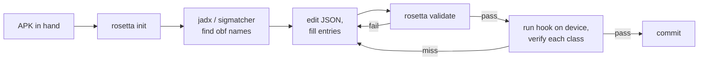

# Authoring maps

You have an Android app you want to hook. You have an APK and a fresh
copy of jadx (or sigmatcher, or both). You want a working map for
the running version. This page walks through the workflow.

## Workflow at a glance



The loop is: scaffold → discover → edit → validate → verify on
device → commit. Each iteration adds a few classes; you typically
do **not** try to enumerate the whole app's surface up front.

## 1. Scaffold

```sh
npx rosetta init com.example.app 3.4.5 --version-code 30405
```

This writes `maps/com.example.app/30405.json` — a plain strict-JSON
skeleton (no comments; field documentation lives in
[Map format](format.md)) with all top-level metadata filled in
(including the required `version_code` you passed) and a single worked
example class entry under `classes` to edit in place. `--version-code`
is mandatory: it is the authoritative selection key and the default
filename, so there's no placeholder to remember to replace.

By default the path is `maps/<app>/<version_code>.json`. Override with
`-o <path>`:

```sh
npx rosetta init com.example.app 3.4.5 --version-code 30405 -o vendor/maps/example-30405.json
```

Pass `--force` if the file already exists and you want to overwrite.

See [CLI — `rosetta init`](../cli/init.md) for the full reference.

## 2. Discover obfuscated names

How you get from real names to obfuscated names is **out of scope
for rosetta-frida** — the library consumes maps, it doesn't produce
them. Three common sources:

### sigmatcher (automated)

[sigmatcher](https://github.com/0xKD/sigmatcher) matches each class
in your APK against a signature library you build up over time. It
emits a `rosetta-frida`-compatible map directly. Best for keeping
maps fresh across releases — once you've signature-matched a class
once, the signature usually survives obfuscation rotation.

### jadx (manual)

For a one-off, open the APK in jadx, search for distinctive class
features, and copy the obfuscated class names out by hand.

The thing you anchor on is whatever about the class **survives
obfuscation**. The obfuscator rewrites *names* — class names, method
names, field names — but it cannot rewrite the *data* a class embeds or
the *framework types* it is bound to. Those are your anchors.

Distinctive features to anchor on, in rough order of how often they
apply (most apply to almost any class; AIDL is the rare lucky case):

1. **Stable string literals.** The single most broadly applicable
   anchor. Error messages, logging tags, JSON keys, algorithm names
   (`"AES/GCM/NoPadding"`), URL paths — any string the developer wrote
   is **data, not a name**, so the obfuscator leaves it untouched. Search
   the dex for the string; the containing class is your candidate. Even
   a deep, fully-internal class with no public API surface is reachable
   this way. See
   [Recipe — string-anchored class](../recipes/string-anchored-class.md).
2. **Stable framework parent / superclass.** A class that extends or
   implements a framework type — `android.app.JobService`,
   `android.os.Binder`, `android.content.BroadcastReceiver`,
   `java.lang.Runnable` — keeps that parent across rotations, because the
   framework type is *not* part of the app and is not obfuscated. Pin the
   rotating subclass by its stable parent via `extends`. See
   [Recipe — superclass-anchored method](../recipes/superclass-anchored-method.md).
3. **AIDL `DESCRIPTOR` constant (the lucky special case).** *When the
   class is an AIDL stub*, it carries a stable
   `public static final String DESCRIPTOR = "com.example.app.IFoo"` that
   survives obfuscation — a particularly strong anchor. But most classes
   are not AIDL stubs, so treat this as a bonus when it applies rather
   than the default plan. See
   [Recipe — AIDL stub hooks](../recipes/aidl-stub-hook.md).
4. **AIDL transaction codes.** `TRANSACTION_xxx = 1`, `2`, `3`. Like the
   descriptor, only present on the AIDL surface; less stable than the
   descriptor but still roughly anchor a stub class.

### hand-author from a Frida runtime trace

When sigmatcher and jadx don't reach (e.g. a class that's only
loaded after a network response), attach Frida, log the runtime
class graph as the relevant code path executes, and hand-author the
mapping from the trace output. This is the "verified via Frida
runtime trace" path you see in many `MapSource.notes`.

## 3. Fill the JSON entries

Open the file and replace the example with real classes:

```json
{
    "schema_version": 4,
    "app": "com.example.app",
    "version": "3.4.5",
    "version_code": 30405,
    "captured_at": "2026-05-13",
    "sources": [
        { "tool": "sigmatcher", "config": "signatures/example.json", "classes": 12 },
        { "tool": "hand-authored", "classes": 3, "notes": "verified on emulator" }
    ],
    "classes": {
        "com.example.app.IRemoteService$Stub": {
            "obfuscated": "aaaa",
            "kind": "class",
            "source": "sigmatcher",
            "methods": {
                "requestTicket": {
                    "obfuscated": "c",
                    "signature": "(Landroid/os/Bundle;Lbbbb;)V"
                }
            }
        }
    }
}
```

### Tips for filling entries

**Anchor on what survives obfuscation, generically.** For most classes
that means a stable string literal the class embeds or a stable framework
parent the class extends (set `extends`). These cover the broad majority
of classes — including deep internal ones with no exposed API. See the
[string-anchored](../recipes/string-anchored-class.md) and
[superclass-anchored](../recipes/superclass-anchored-method.md) recipes.

> **Anchors live in the signatures source, not the map.** As of
> `schema_version: 4` the published map is a *pure* real→obfuscated
> mapping: it carries no `anchors`, `aidl_descriptor`, or `aidl_txn`
> fields, and no `aidl_stub` / `aidl_callback` class kinds (AIDL stubs are
> just `kind: class`, callbacks `kind: interface`). The stable strings,
> AIDL descriptors, and transaction codes you anchor on are *finding
> evidence* — they belong in the sigmatcher signatures YAML that locates
> the class, never in the emitted map. The map only records "this real
> name → this obfuscated name."

**Use the overload-array form only when you need to.** Most methods
have one overload in the map; the single-form is cleaner. Switch to
the array form (`"foo": [ { ... }, { ... } ]`) only when one real
name has multiple obfuscated entries.

**Include cross-class type refs in signatures.** When a method takes
or returns a mapped class, the signature uses its obfuscated name
(`Lbbbb;` not `Lcom/example/app/IServiceCallback;`). This is what
Frida ultimately needs; the resolver translates between them.

## 4. Validate

```sh
npx rosetta validate maps/com.example.app/30405.json
```

Success:

```text
OK: maps/com.example.app/30405.json — com.example.app@3.4.5, 15 class(es), schema_version=4
```

Failure surfaces specific issues:

```text
FAIL: maps/com.example.app/30405.json — invalid map
  at classes.com.example.app.Foo.obfuscated: required
  at classes.com.example.app.Bar.methods.baz.signature: must match /\(.*\)[^()]+/
```

Run validate before every commit. It catches typos and missing
fields long before the map ships to a device.

See [CLI — `rosetta validate`](../cli/validate.md) for the full
reference. Inputs are JSON or YAML only.

## 5. Verify on device

Validation only checks the file shape. To check the map *matches the
running app*, attach to the device:

```sh
npx frida-compile hook.ts -o hook.bundle.js
frida -U -l hook.bundle.js com.example.app
```

The attach-time **health check** iterates every class in the map and
verifies `Java.use(obfName)` succeeds (after the target-namespace guard).
Since the map is a pure real→obfuscated mapping there is nothing further
to assert against a loaded class. With `trace: true` in the session
options:

```text
[rosetta] map-load com.example.app@3.4.5 schema=4 classes=15
[rosetta] health-check PASS rate=100.0% threshold=80.0% failures=0
```

A failed check tells you which class entries are wrong:

```text
[rosetta] health-check FAIL rate=80.0% threshold=80.0% failures=3
```

Subscribe programmatically to see the failed entries:

```typescript
rosetta.events.onType('health-check', (e) => {
    if (!e.passed) {
        send({ failed: e.failedEntries });
    }
});
```

For each failed entry, recheck:

1. Did the obfuscated name rotate? (Update from jadx.)
2. Did the obfuscated *method* letters move? (Update the right column.)

The anchors/descriptors you originally located the class by are *signatures*
authoring concerns and live in the sigmatcher YAML — they are not part of the
emitted map, so there is nothing anchor-related to edit in the map itself.

## 6. Commit

One map per `(app, version)`. Commit the JSON file under
`maps/<app>/<version>.json`. The community maps repo (V2+) will
PR-gate by schema validation; until then, your own repo is fine.

Use a descriptive commit message:

```text
Add map for com.example.app@3.5.0

Re-anchored IRemoteService$Stub (aaaa → aaab), BlobCache (hhhh →
ihhh). Method letters c/d/e/f all stable across the rotation.
sigmatcher caught 12/15; the remaining 3 (the anonymous inner-class
and two synthetic Companions) were hand-authored.
```

## Updating an existing map for a new version

When the next release ships:

1. Copy the previous version's map to a new file named for the **new**
   `version_code` (the filename is always the version_code, never the
   versionName): `cp maps/com.example.app/30405.json maps/com.example.app/30500.json`
2. Update the top-level `version` label **and** `version_code` — the
   latter is the authoritative key the runtime selects by, so a stale
   `version_code` makes the session reject the map. Keep the filename
   in lockstep with the new `version_code` (here `30500`).
3. Re-run sigmatcher — the anchors that locate each class live in the
   signatures YAML, so refreshing the map is a sigmatcher pass.
4. For classes sigmatcher couldn't find, jadx them by hand using the
   anchors that survived (stable strings, framework parents, and —
   where they apply — AIDL descriptors). These guide your search; only
   the resolved real→obfuscated names land in the map.
5. Validate + verify on device.

In practice **method letters are more stable than class names**.
When a class rotates `aaaa → aaab`, the methods inside (`c`, `f`)
usually survive — so updating a map is mostly updating the left
column of the table.

## Authoring alternative formats

If hand-writing JSON isn't your preferred authoring environment:

- **YAML** — write `maps/com.example.app/3.4.5.yaml`, then
  `rosetta convert maps/com.example.app/3.4.5.yaml -o maps/com.example.app/30405.json`.

Strict JSON is the canonical on-disk format; YAML is the one authoring
convenience. TS/JS inputs are not supported; author as JSON or YAML. See
[Conversion](conversion.md) for the full converter docs.

## Common authoring mistakes

- **Anchoring the wrong thing in the signatures source.** A class
  located only by its `obfuscated` name with no stable evidence (a
  string literal, a framework parent) is a guess — nothing catches it
  when the name rotates to a *different* class. Anchor every signature
  on something obfuscation survives. (Those anchors live in the
  sigmatcher YAML; the emitted map records only the resolved names.)
- **Real-name `extends` chains that don't terminate in `classes`.**
  When a class's `extends` references another real name, that name
  must also be a key in `classes`. Use the obfuscated parent name
  (`java.lang.Object`, `android.os.Binder`, `android.app.JobService`)
  for parents you don't want to map.
- **Mixing real and obfuscated class refs in signatures.**
  Signatures always use obfuscated refs (`Lbbbb;`, not
  `Lcom/example/app/IServiceCallback;`). The resolver handles the
  translation in the other direction at lookup time.
- **Forgetting to bump `version_code` (and `version`)** when copying a
  map for a new release. `version_code` is the authoritative selection
  key — the session's version check catches a stale code loudly, but
  it's still confusing if you have to figure out why.
- **Adding entries with no `source`.** Not fatal — `source` is
  optional — but tracking provenance pays off when you're debugging
  six months later and wondering "where did this entry come from."
