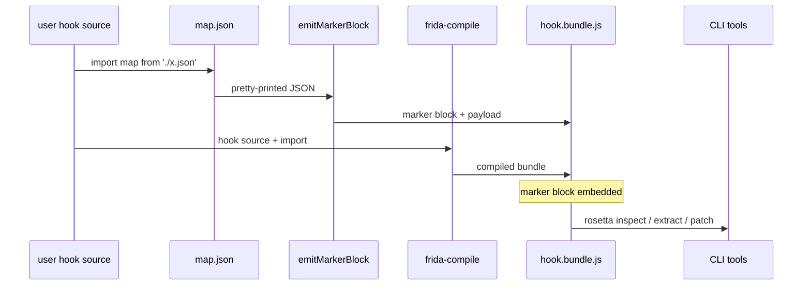

# Marker block

The compiled `.js` bundle wraps the embedded map in a **PEM-style
marker block** inspired by `-----BEGIN PUBLIC KEY-----`. This makes
the map locatable and replaceable in a compiled bundle without
re-running `frida-compile`.

## Why a marker block

Compiled bundles are minified, single-line, and otherwise opaque.
Without a marker block, the only way to swap the embedded map for a
new version is to re-run `frida-compile` — which means having the
source tree, the right Node version, and the right `frida-compile`
version in the same place at the same time.

With a marker block, three operations become regex-only:

- [`rosetta inspect`](../cli/inspect.md) — `(app, version, class
  count)` one-liner.
- [`rosetta extract`](../cli/extract.md) — pull the embedded map
  back out into a standalone JSON file.
- [`rosetta patch`](../cli/patch.md) — replace the embedded map in
  place.

CI workflows can pre-compile a bundle once, then patch in
version-specific maps per environment without ever touching
`frida-compile`.

## Block shape

### Single-map form

```js
/*! -----BEGIN ROSETTA MAP----- */
/*! app: com.example.app | version: 3.4.5 | schema: 2 | classes: 15 */
const __rosetta_map = {
    "schema_version": 2,
    "app": "com.example.app",
    "version": "3.4.5",
    "version_code": 30405,
    "classes": { /* ... */ }
};
/*! -----END ROSETTA MAP----- */
```

### Registry form

For multi-version bundles (`-----BEGIN ROSETTA MAP REGISTRY-----`):

```js
/*! -----BEGIN ROSETTA MAP REGISTRY----- */
/*! app: com.example.app | versions: 3 | classes: 45 */
const __rosetta_maps = {
    "3.4.5": { /* ... */ },
    "3.4.6": { /* ... */ },
    "3.5.0":  { /* ... */ }
};
/*! -----END ROSETTA MAP REGISTRY----- */
```

`apps: mixed` substitutes for the app name in the header if a
registry contains maps for multiple apps (an unusual but supported
shape).

### V2+ runtime-injection placeholder

Not implemented in V1, but the format reserves space:

```js
/*! -----BEGIN ROSETTA MAP----- */
let __rosetta_map = null;  // populated by rosetta.injectMap(...)
/*! -----END ROSETTA MAP----- */
```

V2 will ship `rosetta.injectMap(map)` to populate this slot at attach
time. The marker tokens stay the same; only the payload shape
changes.

## Design properties

- **PEM-style markers.** The familiar `-----BEGIN ...-----` /
  `-----END ...-----` convention has extensive regex tooling and
  examples online. Users can parse it with a one-line regex.
- **No version in the marker.** Format versioning lives inside the
  payload as `schema_version`. The marker stays stable across schema
  evolutions — which means tooling written today still finds the
  block in tomorrow's bundles.
- **`/*! ... */` block comments.** The bang preserves the marker
  through aggressive minifiers (terser, esbuild) per the long-
  established "important comment" convention. This is what keeps the
  block intact after `frida-compile --no-source-maps -c` or similar.
- **Payload is syntactically valid JS.** A bundle with the block
  untouched still loads correctly. Tools that don't know about the
  marker block see a normal JS bundle.
- **Label distinguishes single from registry.** Consumers regex on
  `-----BEGIN ROSETTA MAP\b` and dispatch on the suffix.

## Extraction regex

```regex
/-----BEGIN ROSETTA MAP[A-Z ]*-----[\s\S]*?-----END ROSETTA MAP[A-Z ]*-----/
```

The library exports it as `MARKER_REGEX` (with capture groups and the
global flag added) for callers that want to scan bundles directly:

```typescript
import { MARKER_REGEX } from 'rosetta-frida';

const matches = bundleSrc.matchAll(MARKER_REGEX);
for (const m of matches) {
    const label = m[1]?.trim();  // '' for single, 'REGISTRY' for registry
    const body = m[2];           // payload between BEGIN and END
    // ...
}
```

The `[A-Z ]*` tail in the regex is intentional — it future-proofs
against new suffixes like `PLACEHOLDER` without forcing users to
change their pattern.

## Programmatic API

### `emitMarkerBlock(map)`

Emit a single-map marker block. The return value is plain JS source
suitable for concatenation with a compiled bundle.

```typescript
import { emitMarkerBlock, loadMap } from 'rosetta-frida';

const map = await loadMap('./maps/com.example.app/30405.json');
const markerSrc = emitMarkerBlock(map);

// markerSrc is:
//   /*! -----BEGIN ROSETTA MAP----- */
//   /*! app: com.example.app | version: 3.4.5 | schema: 2 | classes: 15 */
//   const __rosetta_map = { ... };
//   /*! -----END ROSETTA MAP----- */
```

### `emitMarkerRegistry(maps)`

Same for the registry form:

```typescript
import { emitMarkerRegistry } from 'rosetta-frida';

const registry = {
    '3.4.5': map_2_16_31,
    '3.4.6': map_2_16_32,
    '3.5.0': map_2_17_0,
};
const registrySrc = emitMarkerRegistry(registry);
```

### `parseMarkerBlock(bundleSrc)`

Parse the block out of a compiled bundle:

```typescript
import { parseMarkerBlock } from 'rosetta-frida';

const parsed = parseMarkerBlock(bundleSrc);
if (parsed.kind === 'single') {
    console.log(parsed.map.app, parsed.map.version);
    console.log('block at', parsed.range);   // [start, end)
} else {
    // parsed.kind === 'registry'
    console.log('versions:', Object.keys(parsed.maps));
}
```

Throws [`MarkerBlockError`](../reference/errors.md#markerblockerror)
on:

- No BEGIN marker found.
- BEGIN found but no matching END (unterminated).
- Payload doesn't have the expected `const __rosetta_map[s] = ...;`
  shape.
- Payload object literal isn't valid JSON.

### `patchMarkerBlock(bundleSrc, newPayload)`

Replace the embedded payload with a fresh block sourced from a new
map (or registry). The CLI's `rosetta patch` is a thin wrapper around
this:

```typescript
import { patchMarkerBlock } from 'rosetta-frida';

const newBundleSrc = patchMarkerBlock(oldBundleSrc, newMap);
await writeFile('hook.bundle.js', newBundleSrc, 'utf8');
```

### Constants

| Constant | Value |
|---|---|
| `BEGIN_MARKER` | `'-----BEGIN ROSETTA MAP-----'` |
| `END_MARKER` | `'-----END ROSETTA MAP-----'` |
| `BEGIN_REGISTRY` | `'-----BEGIN ROSETTA MAP REGISTRY-----'` |
| `END_REGISTRY` | `'-----END ROSETTA MAP REGISTRY-----'` |
| `MARKER_REGEX` | The extraction regex above, with capture groups + `g` flag. |

## Embedding flow



## Manual embedding

V1 expects you to wrap the import in a marker block manually until
the [`frida-compile` plugin](../recipes/frida-compile-integration.md)
ships. The recipe:

```sh
# 1. Compile your hook normally.
npx frida-compile hook.ts -o hook.compiled.js

# 2. Emit the marker block.
node -e "
  import('rosetta-frida').then(async ({ emitMarkerBlock, loadMap }) => {
    const map = await loadMap('maps/com.example.app/30405.json');
    process.stdout.write(emitMarkerBlock(map));
  });
" > marker.js

# 3. Concatenate.
cat marker.js hook.compiled.js > hook.bundle.js
```

The resulting bundle has the marker block at the very top and
everything else after. The CLI tools find it correctly because the
regex is non-greedy and the markers are uniquely shaped.

This is awkward and the `frida-compile` plugin will subsume it. For
now it's the one rough edge in the V1 surface — see
[`frida-compile` integration recipe](../recipes/frida-compile-integration.md#manual-marker-wrapping)
for the full walkthrough.

## Why no version in the marker

Format-versioning the marker block separately from the payload's
`schema_version` was deliberately rejected. The marker is a *location
beacon* — its only job is to mark "here's a payload that knows its
own version." Format changes that need to be visible should live in
the payload's `schema_version`, where every consumer that parses the
payload already reads it.

The exception is the V2+ placeholder form (`let __rosetta_map = null;`
instead of `const __rosetta_map = { ... };`). That distinction is
detectable from the payload shape, not from the marker — same
markers, different payload.

## Why `/*! ... */` not `//`

Two reasons:

1. **Minifier preservation.** Terser, esbuild, and friends drop
   line comments by default. Block comments with `/*!` prefix are
   the canonical "important" comment that minifiers preserve.
2. **Single-token regex.** The extraction regex works against a
   single-line minified bundle exactly as well as it works against
   pretty-printed output, because the block comments don't depend on
   line boundaries.

`emitMarkerBlock` emits the marker as a four-line construct for
readability when the bundle isn't minified; after minification, the
markers collapse onto a single line and the regex still matches.

## What can go wrong

| Symptom | Cause | Fix |
|---|---|---|
| `inspect` says "no rosetta-frida marker block found" | The bundle never had a marker block, or it got stripped. | Re-build with the manual wrapping recipe; check your minifier config preserves `/*! */` comments. |
| `extract` succeeds but `parseMarkerBlock` throws "payload is not valid JSON" | Someone hand-edited the embedded JS literal and broke JSON parseability. | Use `rosetta patch` instead of hand-editing. |
| Two marker blocks in one bundle | The user concatenated two bundles, each with their own block. | Strip one; only the leftmost is parsed (the regex is non-greedy on the *first* match). |
| `patch` silently writes the wrong file | Forgot `-o`, which defaults to in-place. | That's by design; see [`rosetta patch`](../cli/patch.md) for the flag semantics. |
