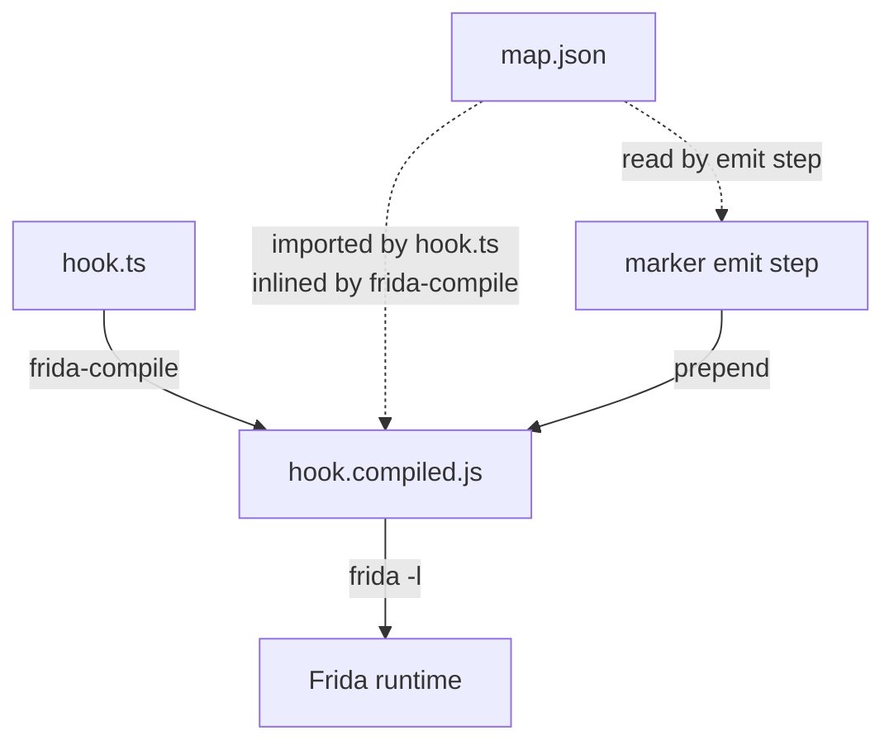

# Recipe — `frida-compile` integration

The build pipeline that turns a TypeScript hook source plus a JSON
map into a single self-contained Frida bundle. This page covers the
V1 workflow — including the **manual marker-block wrapping** step
required until the `frida-compile` plugin lands.

## The shape of a hook bundle



Two artifacts: your hook source (TypeScript or modern JS) and the
JSON map. `frida-compile` resolves the `import map from
'./x.json'` and inlines the value. The compiled bundle is a single
`.js` file that Frida loads unchanged.

## Getting the map: `pull` → bundle

The JSON map normally comes from the community
[`rosetta-maps`](https://github.com/Xiddoc/rosetta-maps) repo via
[`rosetta pull`](../cli/pull.md), which runs once at build time on your
machine:

```sh
npx rosetta pull com.example.app@30405 --require-sidecar
# → maps/com.example.app/30405.json
npx frida-compile hook.ts -o hook.bundle.js
```

`pull` verifies a detached `.json.sha256` **transport-integrity sidecar**
against the exact fetched bytes before writing the map — so the bytes you
bundle are the bytes the maps repo published. Pass `--require-sidecar` in CI
/ release builds to fail closed if a map ships without a sidecar (the
default warns and proceeds during the rollout). This same sidecar contract
is honoured by the rosetta-xposed Gradle "bake a pulled map" step, so a map
baked into an LSPosed APK is verified identically. See
[`rosetta pull`](../cli/pull.md#sidecar-transport-integrity-verification)
for the full policy table.

## The simplest pipeline

```sh
npx frida-compile hook.ts -o hook.bundle.js
```

This produces a working bundle. Run it:

```sh
frida -U -l hook.bundle.js com.example.app
```

The map is embedded inside the compiled bundle as a JS object literal
(courtesy of `frida-compile`'s `--inline` default for JSON imports).
The hook resolves real names against it at runtime.

You **do not need** a marker block to run the hook. The marker block
is a separate concern — see below.

## Why the marker block matters

Without a marker block, the embedded map is opaque from outside the
script. Three CLI commands depend on the marker block to work:

- `rosetta inspect <bundle.js>` — what does this bundle target?
- `rosetta extract <bundle.js> -o out.json` — pull the map out.
- `rosetta patch <bundle.js> --map new.json` — swap the map without
  recompiling.

If you don't need those operations, skip the marker-block step.
Plenty of users will be fine without it — the hook runs either way.

If you do want them — and especially if your CI compiles the bundle
once and patches in per-environment maps — you need the marker
block.

## Manual marker wrapping

In V1 there's no `frida-compile` plugin yet. The marker-block step
runs as a separate post-compile pass. The recipe:

### Step 1 — compile normally

```sh
npx frida-compile hook.ts -o hook.compiled.js
```

### Step 2 — emit the marker block

```sh
node --input-type=module -e "
  import { emitMarkerBlock, loadMap } from 'rosetta-frida';
  const map = await loadMap('maps/com.example.app/30405.json');
  process.stdout.write(emitMarkerBlock(map) + '\n');
" > marker.js
```

The result is a 4-line JS snippet that looks like:

```js
/*! -----BEGIN ROSETTA MAP----- */
/*! app: com.example.app | version: 3.4.5 | schema: 3 | classes: 15 */
const __rosetta_map = { /* ... pretty-printed JSON ... */ };
/*! -----END ROSETTA MAP----- */
```

### Step 3 — concatenate

```sh
cat marker.js hook.compiled.js > hook.bundle.js
```

The marker block goes at the very top. The CLI tools find it by
regex, so position-in-file doesn't matter — but top of file is
conventional.

### Step 4 — verify

```sh
npx rosetta inspect hook.bundle.js
# com.example.app@3.4.5, schema_version 3, 15 classes
```

The marker is there. `extract` and `patch` work too.

## Wrapping it in a `package.json` script

```json
{
    "scripts": {
        "build:hook": "frida-compile hook.ts -o hook.compiled.js && npm run embed:marker && cat marker.js hook.compiled.js > hook.bundle.js && rm marker.js hook.compiled.js",
        "embed:marker": "node --input-type=module -e \"import('rosetta-frida').then(async ({ emitMarkerBlock, loadMap }) => { const m = await loadMap('maps/com.example.app/30405.json'); require('fs').writeFileSync('marker.js', emitMarkerBlock(m)); });\""
    }
}
```

Then `npm run build:hook` does the whole pipeline.

## Wrapping it in a Node script

For non-trivial builds, a small Node script is cleaner than chained
`bash`:

```typescript
// scripts/build-bundle.ts
import { execSync } from 'node:child_process';
import { emitMarkerBlock, loadMap } from 'rosetta-frida';
import { readFileSync, writeFileSync, unlinkSync } from 'node:fs';

const MAP_PATH = process.env.ROSETTA_MAP ?? 'maps/com.example.app/30405.json';
const HOOK_SRC = 'hook.ts';
const OUT = 'hook.bundle.js';

execSync(`npx frida-compile ${HOOK_SRC} -o hook.compiled.js`, { stdio: 'inherit' });
const compiled = readFileSync('hook.compiled.js', 'utf8');
const map = await loadMap(MAP_PATH);
const marker = emitMarkerBlock(map);
writeFileSync(OUT, marker + '\n' + compiled, 'utf8');
unlinkSync('hook.compiled.js');

console.log(`built ${OUT}; ${marker.split('\n').length} marker lines, ${compiled.length} bytes compiled`);
```

```sh
node --import tsx scripts/build-bundle.ts
```

## Registry-bundle variant

For a multi-version bundle, swap `emitMarkerBlock(map)` for
`emitMarkerRegistry(registry)`:

```typescript
import { emitMarkerRegistry, loadMap } from 'rosetta-frida';

const registry = {
    '3.4.5': await loadMap('maps/com.example.app/30405.json'),
    '3.4.6': await loadMap('maps/com.example.app/3.4.6.json'),
    '3.5.0':  await loadMap('maps/com.example.app/3.5.0.json'),
};
const marker = emitMarkerRegistry(registry);
```

See [Multi-version bundles recipe](multi-version-bundle.md) for the
runtime semantics.

## V1.5 — the `frida-compile` plugin

The plan: a small plugin that hooks `frida-compile`'s JSON-import
pipeline, intercepts `import map from './x.json'` calls where the
JSON validates as a `RosettaMap`, and emits the marker block
automatically.

The user-facing surface will be:

```sh
npx frida-compile --plugin rosetta-frida hook.ts -o hook.bundle.js
```

Or, more likely, an entry in a `frida-compile` config file:

```json
// frida-compile.config.json
{
    "plugins": ["rosetta-frida/plugin"]
}
```

Once that lands, the manual two-step recipe goes away — every
bundle gets a marker block automatically.

Until then, the manual step works fine.

## Building with esbuild instead

If you've replaced `frida-compile` with esbuild (e.g. for faster
incremental builds or for a more standard JS toolchain), the same
manual marker-wrapping step works — esbuild emits the same kind of
single-file bundle, and the marker emit + concat pass operates on
the bytes regardless of what produced them.

```sh
npx esbuild hook.ts --bundle --format=iife --outfile=hook.compiled.js
node --import tsx scripts/build-bundle.ts
```

The IIFE format matters here — Frida loads a `Java.perform`-shaped
script, not a module. `frida-compile` handles that for you; with
esbuild you need to opt in via `--format=iife`.

## Watch mode

For dev-loop iteration, run `frida-compile` in watch mode and
re-prepend the marker on save:

```sh
npx frida-compile hook.ts -o hook.compiled.js --watch &
node --import tsx scripts/watch-bundle.ts &
```

Where `watch-bundle.ts` uses `fs.watch` on `hook.compiled.js` and
re-runs the marker emit + concat. Or use [`chokidar`](https://github.com/paulmillr/chokidar)
for a more robust watcher.

V1.5's `frida-compile` plugin will fold this into the regular watch
mode.

## Caveats

- **Minifier preservation.** If you minify the compiled bundle
  before prepending the marker, the marker stays readable (it's
  outside the minified region). If you minify *after*, make sure
  your minifier preserves `/*! ... */` comments (terser does by
  default; esbuild does with `--legal-comments=inline`).
- **Source maps.** The marker block lives at the top of the file,
  which shifts all source-mapped line numbers by ~4 lines. Frida's
  error reporting normally tracks the runtime address, not the
  source line, so this rarely matters in practice.
- **Two bundles in one file.** Don't concatenate two compiled
  bundles each carrying a marker block — the extraction regex
  matches the first marker non-greedily and ignores the second.

## Related

- [Marker block reference](../maps/marker-block.md)
- [CLI — `rosetta inspect`](../cli/inspect.md)
- [CLI — `rosetta patch`](../cli/patch.md)
- [Multi-version bundles](multi-version-bundle.md)
