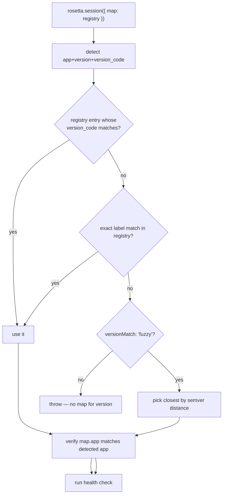

# Recipe — multi-version bundles

A **multi-version bundle** is a single compiled `.js` script that
carries maps for many app versions in a registry block, and lets
the runtime pick the right one at attach time by the detected
version.

This page describes the workflow and the runtime semantics. Some of
the supporting CLI (`rosetta merge-bundle`) is deferred to V1.5;
**you can still use registry bundles in V1 by building them
manually**, which is the path documented here.

## When to use a registry bundle

- **Fleet deployment** — you ship one bundle to many devices running
  different versions of the target app. The bundle Just Works on each.
- **CI matrix** — you test the same hook against several versions in
  one pipeline without recompiling.
- **Long-tail support** — the hook supports older versions you can't
  drop, plus the latest, in a single artifact.

When you control the deployment 1:1 with the version, the simpler
[per-environment patch workflow](../cli/patch.md#ci-pattern-compile-once-patch-per-environment)
is usually cleaner. Registry bundles win when one binary needs to be
right for many environments.

## How the runtime picks



The selection algorithm is in [`pickMapForVersion`](../api/session.md#versionmatch):

- **By `version_code` first (authoritative).** When a `version_code`
  was detected (or supplied via `versionCode`), the registry is scanned
  for the entry whose `version_code` equals it and that map is selected
  directly — regardless of its label. This match is exact, never fuzzy.
- **Exact label mode (default fallback).** When no `version_code` is
  available or no entry carries the detected code, the registry must
  contain an entry whose key equals the detected version *label*.
  Missing → throw.
- **Fuzzy mode.** Parse each key into a `[major, minor, patch]`
  tuple. Distance = `Δmajor × 10_000 + Δminor × 100 + Δpatch`. Tie
  → lower version wins.

Fuzzy is opt-in. Wrong-version maps silently corrupt hooks; the
default fails loudly and tells you to ship a map for the detected
version.

## Building a registry bundle manually (V1)

Until `rosetta merge-bundle` lands in V1.5, you build registry
bundles by hand. There are two paths.

### Path A — registry built into the hook source

```typescript
// hook.ts
import map_2_16_31 from './maps/com.example.app/30405.json' with { type: 'json' };
import map_2_16_32 from './maps/com.example.app/3.4.6.json' with { type: 'json' };
import map_2_17_0  from './maps/com.example.app/3.5.0.json'  with { type: 'json' };

import { rosetta, type RosettaMapRegistry } from 'rosetta-frida';

const registry = {
    '3.4.5': map_2_16_31,
    '3.4.6': map_2_16_32,
    '3.5.0':  map_2_17_0,
} as unknown as RosettaMapRegistry;

Java.perform(() => {
    rosetta.session({ map: registry });
    // ... your hooks here ...
});
```

```sh
npx frida-compile hook.ts -o hook.bundle.js
```

`frida-compile` inlines all three JSON imports. The compiled bundle
carries the registry; the runtime picks the matching entry by the
detected version.

If you want the marker-block embedding (so `rosetta inspect` reports
the registry, and `rosetta patch` can swap the whole registry block),
follow the [manual marker wrapping recipe](frida-compile-integration.md#manual-marker-wrapping)
but emit `emitMarkerRegistry(registry)` instead of
`emitMarkerBlock(map)`.

### Path B — `patch` an existing single-map bundle with a registry

If you already have a working single-map bundle and want to convert
it to a registry without re-running `frida-compile`:

1. Build a registry JSON file on disk:

    ```sh
    cat <<EOF > registry.json
    {
        "3.4.5": $(cat maps/com.example.app/30405.json),
        "3.4.6": $(cat maps/com.example.app/3.4.6.json),
        "3.5.0":  $(cat maps/com.example.app/3.5.0.json)
    }
    EOF
    ```

    or use `jq -s` / a tiny Node script — anything that produces a
    record-of-RosettaMap. `rosetta patch` accepts strict JSON (the
    constituent maps' authoring metadata both survive the concat).

2. Patch the single-map bundle with the registry. The patch
   command's loader heuristic detects "no top-level
   `schema_version`" and treats the input as a registry:

    ```sh
    npx rosetta patch hook.bundle.js --map registry.json -o hook.multi.bundle.js
    ```

3. Verify:

    ```sh
    $ npx rosetta inspect hook.multi.bundle.js
    registry: com.example.app, versions=[3.4.5, 3.4.6, 3.5.0], 45 classes total
    ```

The runtime now picks per-version at attach time.

## Enabling fuzzy version matching

Off by default. Enable per-session:

```typescript
rosetta.session({
    map: registry,
    versionMatch: 'fuzzy',
});
```

With `'fuzzy'`, the session falls back to the closest registry entry by
**component-wise lexicographic** distance `[Δmajor, Δminor, Δpatch]`
(compared major-first; ties → lower version). If the detected version
is `3.4.7` and the registry has `[3.4.5, 3.4.6, 3.5.0]`, the session
picks `3.4.6` (`Δ = [0,0,1]`) over `3.4.5` (`Δ = [0,0,2]`) and `3.5.0`
(`Δ = [0,1,7]` — the minor delta dominates).

The picked map's `version` field will *not* equal the detected
version. The session attaches and runs; the picked-version is
visible in the `map-load` event:

```typescript
rosetta.events.onType('map-load', (e) => {
    if (e.version !== rosetta.map.extract().version) {
        // (in this code, e.version === extract().version; the
        // session-level detected version differs.)
    }
});
```

Inspect the session value directly for the detected version:

```typescript
const session = rosetta.session({ map: registry, versionMatch: 'fuzzy' });
send({
    stage: 'fuzzy-pick',
    detected: session.version,
    picked: session.map.version,
});
```

## Expanded matching — ranges, ceilings, ranked hints

The string `'fuzzy'` is shorthand for the richer object form, whose
knobs are all opt-in (and default to the legacy behaviour). Selection
order is *exact `version_code` → exact label → code range → label range
→ nearest label*, so an exact match always wins.

**Constrain by `version_code` range** (the authoritative key):

```typescript
rosetta.session({
    map: registry,
    versionMatch: { versionCodeRange: { min: 30400, max: 30599 } },
});
// The in-range map closest to the detected version_code wins.
```

**Constrain by version-label range** (semver-ish):

```typescript
rosetta.session({
    map: registry,
    versionMatch: { versionRange: { min: '3.4.0', max: '3.6.0' } },
});
```

**Cap how far a nearest pick may stray** — fail loudly past the ceiling:

```typescript
rosetta.session({
    map: registry,
    versionMatch: { strategy: 'fuzzy', maxDistance: 1 },
});
// A closest map at distance [0,2,0] is rejected (throws) rather than used.
```

**Set a project-wide default via the typed config** (a per-session
`versionMatch` still overrides it):

```typescript
import { resolveConfig } from 'rosetta-frida';

const config = resolveConfig({ versionMatching: { strategy: 'fuzzy', maxDistance: 1 } });
rosetta.session({ map: registry, config });
```

## Inspecting a registry bundle

```sh
$ npx rosetta inspect hook.multi.bundle.js
registry: com.example.app, versions=[3.4.5, 3.4.6, 3.5.0], 45 classes total
```

```sh
$ npx rosetta extract hook.multi.bundle.js -o registry-extracted.json
extract: wrote registry-extracted.json (registry)
```

The extracted file is the full registry — `Record<version, RosettaMap>`.

## V1.5 preview — `rosetta merge-bundle`

V1.5 will ship a one-shot CLI:

```sh
npx rosetta merge-bundle hook.bundle.js \
    maps/com.example.app/30405.json \
    maps/com.example.app/3.4.6.json \
    maps/com.example.app/3.5.0.json \
    -o hook.multi.bundle.js
```

This will subsume both paths A and B above. Until it lands, the
manual workflows are the canonical V1 approach.

## When versions don't match anything

In `exact` mode against a registry that doesn't contain the detected
version, the session throws on creation:

```text
Error: rosetta-frida: no map for version '2.16.99' in registry (available: 3.4.5, 3.4.6, 3.5.0). Pass versionMatch: 'fuzzy' to fall back to the closest map.
```

The error message tells you what's available and how to opt into
fuzzy.

## Related

- [Session API — `versionMatch`](../api/session.md#versionmatch)
- [Map format — multi-version registry](../maps/format.md#multi-version-registry)
- [Marker block — registry form](../maps/marker-block.md#registry-form)
- [CLI — `patch`](../cli/patch.md)
- [CLI — `inspect`](../cli/inspect.md)
