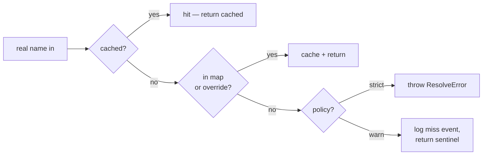

# Design

The four-subsystem architecture and the design decisions that shaped
V1.0. Read this when you want to understand *why* the library is
shaped the way it is.

For the design's external context — the rotation problem, the
distribution model, the V1.5 / V2 roadmap — see the project's
`CLAUDE.md`. This page documents the architecture as implemented.

## The four subsystems

```mermaid
flowchart TB
    USER[user hook<br/>real names]
    subgraph LIB[rosetta-frida runtime]
        T1["Tier 1 / 2 / 3<br/>(rosetta namespace)"]
        SESS[Session]
        RES[Resolver]
        PROXY[Proxy layer]
        DIAG[Diagnostics<br/>(EventBus)]
        MAP[Mapping source<br/>(loaded RosettaMap)]
    end
    FRIDA[Frida Java bridge<br/>Java.use, .overload]

    USER --> T1
    T1 --> SESS
    SESS --> RES
    SESS --> DIAG
    RES <--> MAP
    T1 --> PROXY
    PROXY --> RES
    PROXY --> FRIDA
    RES -->|emit| DIAG
    SESS -->|emit| DIAG
```

The four subsystems, each with a stable internal interface:

1. [Resolver](#resolver) — the core abstraction. Real → obfuscated
   translation.
2. [Mapping source](#mapping-source) — where map data comes from.
3. [Proxy layer](#proxy-layer) — `Java.use(obfName)` wrapper.
4. [Diagnostics](#diagnostics) — the structured event channel.

Plus a top-level **Session** that wires them together at attach time.

## Resolver

The core abstraction. Given a real name (class FQN, method on a
class, field on a class), the Resolver returns an obfuscated name —
or throws a specific error.

### Lookup chain (V1)



1. **Memoized cache** — per-session, keyed by `(class, member,
   argTypes)`.
2. **Mapping lookup** — `map.classes[name]` (or an override
   installed via `rosetta.map.override(...)`).
3. **Fail** — throw `ResolveError` in `strict`, return a sentinel in
   `warn`.

V1 has no discovery layer. The lookup-chain slot at position 3 is
reserved in the architecture for V2+ runtime-discovery strategies; in
V1 it's a clean failure.

### Sentinels — the `warn` failure policy

A sentinel is a JavaScript `Proxy` that:

- Records the missed real name.
- Throws `UnresolvedAccessError` from any property access or call.
- Reports `isSentinel(value) === true` (so adaptive code can branch
  on it instead of crashing).

The intent: a miss in one hook doesn't take down the rest of the
script. The script keeps running; the failure crystallizes only when
the sentinel is actually used. This is the deferred-error path the
design doc calls out.

The trade-off: errors surface at the use site, which can be further
away from the lookup site. For development, `strict` mode is usually
better — fail at the source, not the consumer.

### Reverse index

At construction, the Resolver indexes `obfClass → realClass`. This
enables:

- `translateType(...)` translating real names *to* obfuscated
  (for `.overload(...)`).
- `rosetta.field(instance, name)` reverse-looking-up the instance's
  obfuscated class name to a real name to drive the field lookup.

The reverse index is cheap (one Map entry per class) and is ready
for V2+ runtime-discovery use cases that want to confirm a
discovered name's real-side identity.

## Mapping source

Where map data comes from. The abstraction kept simple in V1:

**V1: build-time import.** Users `import map from './map.json'`;
`frida-compile` bundles the map into the compiled `.js`. The runtime
consumes the in-memory object.

The map can also reach the session via:

- `loadMap(pathOrString)` — for CLI and Node contexts.
- Direct construction — for tests.

**V2+: runtime injection** for hot-reload, remote maps, fleet
management. The marker-block placeholder form (`let __rosetta_map =
null;`) reserves space for this; the seam is there but no
implementation in V1.

## Proxy layer

Tier-2 `rosetta.use(...)` returns a `Proxy` that wraps
`Java.use(obfName)`. The Proxy intercepts:

- **Property reads** (method/field access) — resolves via the map,
  returns either a `MethodHandle` or a `FieldAccessor`.
- **`.overload(...)` on a method handle** — translates real-name
  args before delegating to Frida's overload selector.
- **Cache** — resolved method handles and field accessors are
  memoized per `(proxy, member)`.

This is the only "magic" in the library. It's bounded, predictable,
and replaceable through tier 3 (which exposes `$native` and
`$resolver` for callers that want to drop the proxy).

### Why proxies, not codegen

There were two candidate architectures:

| Approach | Pros | Cons |
|---|---|---|
| **Codegen** — preprocess hook source to substitute real names with obfuscated names ahead of time | Zero runtime overhead; output is debuggable Frida JS | Per-version build artifacts; can't switch maps at runtime; loses "same hook works for any version" property |
| **Runtime wrapper** (chosen) — `m.use(realName)` proxies to `Java.use(obfName)`; mapping loaded at attach time | One hook script works across versions; auto-detection possible; mapping can be hot-swapped | Slightly slower startup; dynamic proxy = more failure modes to surface |

The killer feature is "same hook script works against any version
that has a mapping file." Worth the small runtime cost — and the
proxy layer is bounded enough that "more failure modes" reduces to a
short list of well-documented error classes.

## Diagnostics

Every resolution, every cache event, every failure is a structured
event. Two consumers:

- **Console (trace mode).** `rosetta.session({ trace: true })` prints
  a readable log:
  - `[rosetta] com.example.app.IRemoteService$Stub ← aaaa (map)`
  - `[rosetta] requestTicket ← c (overload: (Bundle, IServiceCallback))`
  - `[rosetta] com.example.app.IUnknown ← MISS`
- **Programmatic.** `rosetta.events.on(...)` and `onType(...)` for
  in-script consumers. Plus a passthrough to Frida's `send()` channel
  for the host controller to log, assert in CI, or persist to disk.

The EventBus is intentionally small (Set of listeners; emit fires
each in order). No Node `EventEmitter` because we want to stay
typed-strict and run inside Frida's JS sandbox without Node stdlib.

## Session lifecycle

The session is the glue that wires the four subsystems together.

Construction order (per `src/session/session.ts`):

1. **Build the EventBus.** Honor `trace: true`.
2. **Resolve `(app, version, version_code)`.** User overrides first;
   auto-detect otherwise (versionName + `getLongVersionCode()`). Emit
   `detect` event.
3. **Pick the map.** Single-map: use as-is. Registry: select by the
   authoritative `version_code` first, falling back to the version
   label (exact, then fuzzy). Emit `map-load` event.
4. **Cross-check.** `map.app === detectedApp`, and the detected
   `version_code` equals `map.version_code` (authoritative) — or the
   version label matches when no code was detected, or the pick was
   fuzzy. Throw `MapVersionMismatchError` on mismatch.
5. **Run the attach-time health check** (unless skipped). Emit
   `health-check` event. Throw `HealthCheckFailedError` in `strict`
   mode if it fails.
6. **Build the Resolver.** Bind it to the map and the EventBus.

After construction, the session is read-only and the ambient
namespace points at its resolver.

## V1.0 MVP scope

What landed in V1.0:

- Resolver with map source + cache. No discovery.
- Proxy layer for tier 2.
- Tier 1 (`rosetta.hook(...)`, `rosetta.proceed(...)`,
  `rosetta.field(...)`, `rosetta.setField(...)`).
- Tier 2 (`rosetta.use(...)`, `rosetta.type(...)`).
- Tier 3 (`rosetta.map.*`, `rosetta.events.*`).
- Methods + fields + classes all covered.
- Schema v2 (`schema_version: 2`), no migrators yet (1→2 was a hard cutover).
- JSON loader + Zod schema validator. YAML and TS-module converters.
- Marker-block embedding in the compiled bundle (manual wrapping;
  `frida-compile` plugin deferred to V1.5).
- Attach-time health check.
- Auto-detect via in-process PackageManager. No ADB.
- Failure policies: `strict` and `warn`. No `discover`.
- Sample app (com.example.app), one version (3.4.5), 15
  hand-authored anonymized mapped classes.
- Diagnostics: stderr trace + structured events.
- CLI scaffold: `init`, `validate`, `convert`, `patch`, `extract`,
  `inspect`.
- One sample hook demonstrating the workflow.
- 611 tests, 100% coverage.

What is deferred:

| Feature | Target version |
|---|---|
| `rosetta diff`, `merge`, `migrate`, `types`, `verify`, `fetch`, `merge-bundle` CLI commands | V1.5 |
| `frida-compile` plugin for auto-marker-wrapping | V1.5 |
| Fuzzy version matching expanded (e.g. version ranges, premium hints) | V1.5 |
| Schema migrators (e.g. a future 2 → 3 bump; the 1 → 2 change was a hard cutover) | V1.5 |
| Public maps repo (`rosetta-frida-maps`) | V2 |
| Runtime injection / hot-reload (`rosetta.injectMap(...)`) | V2 |
| Runtime discovery / self-healing | V2 |
| Native (JNI / ELF symbol) mapping | V2+ |
| Non-Frida runtimes (Xposed, iOS, ART) | V3 |

## Key decisions

### Three tiers, not one

Most hooks live in tier 1. The two higher tiers exist for cases
tier 1 can't express. Higher tiers never lock you out of lower
tiers — every tier-1 call is implementable in tier 2 + tier 3
primitives.

This shape gives newcomers a one-line declarative experience and
experts an escape hatch. Both groups get what they want without
forcing one design on the other.

### Single ambient session

`rosetta.session(...)` sets an ambient. All tier-1/2/3 calls on the
`rosetta` namespace consult that ambient. This makes the common case
— one map per script — trivial.

For multi-session scripts (rare but real), the explicit composition
form is documented. The shape is identical; only the
session-injection point moves.

### Strict JSON (not YAML) as the artifact, plus YAML/TS authoring converters

Strict JSON (no comments, no trailing commas) is the canonical on-disk
format: the data round-trips machine-cleanly, the on-disk shape matches
the runtime shape exactly, and JS bundlers / `frida-compile` consume
the `.json` import natively with no conversion step. Comment-bearing
YAML and TS-module input exist via converters for authors who prefer
them — `rosetta convert` renders those to the canonical JSON artifact —
but the *runtime* only ever sees strict JSON.

### PEM-style marker block

The familiar `-----BEGIN ... -----` / `-----END ...-----` convention
has extensive regex tooling and examples online. `/*! ... */`
preserves through minifiers. No version in the marker itself —
format versioning lives in the payload as `schema_version`.

### Auto-detect in-process only

No ADB. The only auto-detect path is in-process Java:
`ActivityThread.currentApplication().getApplicationContext()
.getPackageManager().getPackageInfo(...)`, reading both
`.versionName.value` (the display label) and the authoritative
`.getLongVersionCode()` (API 28+, falling back to the int
`versionCode`). Pure Frida JS, no external deps, works over
`frida-server`-over-TCP without root.

### Failure policies: `strict` and `warn`

V1 has only these two. `warn` is the default — a miss in one hook
doesn't take down the script. `strict` for CI / tests.

A `discover` policy that runs runtime discovery strategies arrives
in V2 once the discovery subsystem lands. The slot in the Resolver
lookup chain is reserved.

### TypeScript source, JS output

The library's runtime is JS (Frida's sandbox); the source is
TypeScript. Mid-size library; types pay off. Pattern matches
`frida-java-bridge` and `frida-il2cpp-bridge`.

## Where to read more

- [Map format reference](../maps/format.md) — the on-disk schema.
- [Marker block reference](../maps/marker-block.md) — the bundle
  embedding format.
- [Session API](../api/session.md) — the construction-time wiring.
- [Errors](errors.md) — every error class.
- [Events](events.md) — every diagnostic event.
