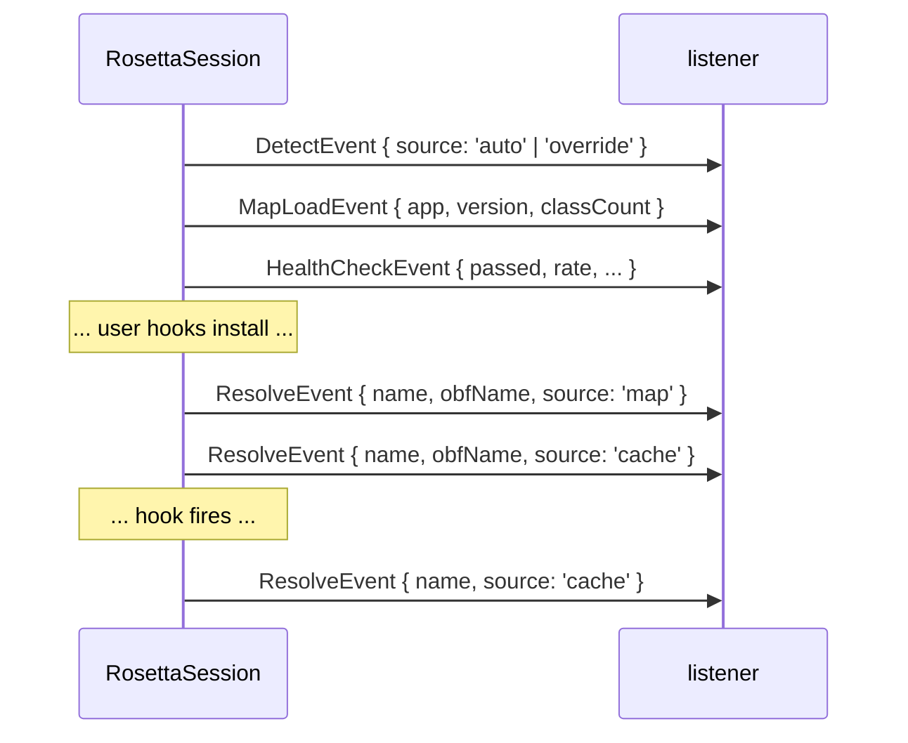

# Diagnostic events

The session's `EventBus` emits four kinds of structured events.
Subscribers — programmatic, via `rosetta.events.on(...)` — get every
event. Trace mode (`trace: true`) also writes each event to
`console.error` as a single-line formatted string. The two channels
coexist; the same event reaches both.

```typescript
type DiagnosticEvent = ResolveEvent | HealthCheckEvent | DetectEvent | MapLoadEvent;
```

## `ResolveEvent`

Emitted every time the Resolver translates a real name to obfuscated
(or misses).

```typescript
interface ResolveEvent {
    type: 'resolve';
    name: string;
    obfName?: string;
    source: 'cache' | 'map' | 'override';
    miss?: boolean;
    classScope?: string;
    overloadSignature?: string;
}
```

| Field | Description |
|---|---|
| `name` | The real name being resolved (class, method, or field). |
| `obfName` | The obfuscated name. Present on hits, absent on misses. |
| `source` | Where this resolution came from. `cache` = memoized; `map` = looked up in the map; `override` = runtime override via `rosetta.map.override(...)`. |
| `miss` | `true` if the lookup failed. The Resolver still emits the event before throwing `ResolveError` / returning a sentinel. |
| `classScope` | For method/field events, the class real name. Undefined for class-level events. |
| `overloadSignature` | For method events, the picked overload's JVM signature (e.g. `(Landroid/os/Bundle;Lbbbb;)V`). |

**Trace-line formats:**

- Hit (method): `[rosetta] com.example.app.IRemoteService$Stub.requestTicket ← c (map) (Landroid/os/Bundle;Lbbbb;)V`
- Hit (class): `[rosetta] com.example.app.IRemoteService$Stub ← aaaa (map)`
- Miss: `[rosetta] com.example.app.IUnknown ← MISS`

**Subscribing:**

```typescript
rosetta.events.onType('resolve', (e) => {
    if (e.miss) {
        send({ alert: 'unresolved', name: e.name, scope: e.classScope });
    }
});
```

**Use cases:**

- Failing CI on any miss.
- Building a map-coverage report after a hook session.
- Logging a method-call trace for forensic analysis.
- Detecting cache-vs-map balance for performance debugging.

## `HealthCheckEvent`

Emitted once at session creation, after the attach-time health
check completes (unless `skipHealthCheck: true`).

```typescript
interface HealthCheckEvent {
    type: 'health-check';
    passed: boolean;
    rate: number;
    failedEntries: readonly string[];
    threshold: number;
}
```

| Field | Description |
|---|---|
| `passed` | `rate >= threshold`. |
| `rate` | Fraction of mapped classes that resolved successfully (`0.0`–`1.0`). |
| `failedEntries` | Real names that failed. Each entry either: `Java.use(obf)` threw, or `aidl_descriptor` didn't match, or an `anchors` string was missing. |
| `threshold` | The configured threshold (default `0.8`). |

**Trace-line format:**

- Pass: `[rosetta] health-check PASS rate=100.0% threshold=80.0% failures=0`
- Fail: `[rosetta] health-check FAIL rate=65.0% threshold=80.0% failures=4`

**Subscribing:**

```typescript
rosetta.events.onType('health-check', (e) => {
    if (!e.passed) {
        send({
            alert: 'health-check-failed',
            rate: e.rate,
            threshold: e.threshold,
            failed: e.failedEntries,
        });
    }
});
```

**Use cases:**

- Auditing which entries broke between releases.
- Triggering a map regeneration in CI when the health check drops.
- Reporting attach-time status to a host controller.

## `DetectEvent`

Emitted once at session creation, after the app + version are
determined.

```typescript
interface DetectEvent {
    type: 'detect';
    app: string;
    version: string;
    source: 'auto' | 'override';
}
```

| Field | Description |
|---|---|
| `app` | The detected (or supplied) Android package name. |
| `version` | The detected (or supplied) version. |
| `source` | `'auto'` if both `app` and `version` came from in-process detection; `'override'` if either was supplied via `SessionOptions`. |

**Trace-line format:**

- `[rosetta] detect auto: com.example.app@3.4.5`
- `[rosetta] detect override: com.example.app@3.4.5`

**Subscribing:**

```typescript
rosetta.events.onType('detect', (e) => {
    send({ stage: 'detect', app: e.app, version: e.version, source: e.source });
});
```

**Use cases:**

- Logging the detected version for downstream tools.
- Asserting in CI that auto-detect picked the expected version.
- Detecting a version mismatch *before* the map-version check
  throws — sometimes you want to handle it gracefully (e.g. fall
  back to a default map).

## `MapLoadEvent`

Emitted once at session creation, after the map is picked (possibly
after registry resolution) and before the health check runs.

```typescript
interface MapLoadEvent {
    type: 'map-load';
    app: string;
    version: string;
    classCount: number;
    schemaVersion: number;
}
```

| Field | Description |
|---|---|
| `app` | The map's `app` field. |
| `version` | The map's `version` field. For registry bundles, this is the picked entry's version. |
| `classCount` | Number of entries in `map.classes`. |
| `schemaVersion` | The map's `schema_version`. Currently always `1`. |

**Trace-line format:**

- `[rosetta] map-load com.example.app@3.4.5 schema=1 classes=15`

**Subscribing:**

```typescript
rosetta.events.onType('map-load', (e) => {
    send({ stage: 'map-load', version: e.version, classes: e.classCount });
});
```

**Use cases:**

- Reporting which map version was actually picked (especially after
  a `versionMatch: 'fuzzy'` fall-back).
- Asserting in CI that the expected map made it into the bundle.

## Event ordering

A clean session-creation flow emits events in this order:



`DetectEvent` always precedes `MapLoadEvent` (you need to know the
version to pick a map). `MapLoadEvent` always precedes
`HealthCheckEvent` (you need a map to check). `ResolveEvent`s flow
indefinitely after.

## Subscribing to all events

```typescript
const off = rosetta.events.on((event) => {
    send({ rosettaEvent: event });
});

// ... later, unsubscribe ...
off();
```

`rosetta.events.on(fn)` returns an unsubscribe function.

## `EventBus` directly

For multi-session scripts or test fixtures, build your own bus:

```typescript
import { EventBus, createSilentBus, formatEvent } from 'rosetta-frida';

const bus = new EventBus();
bus.setTrace(true);   // print every event to stderr
bus.on((e) => { /* ... */ });
bus.emit({ type: 'detect', app: 'com.example.app', version: '1.0.0', source: 'auto' });
```

`createSilentBus()` is a one-line helper that returns an `EventBus`
with trace explicitly off — handy for tests.

`formatEvent(event)` exposes the canonical single-line formatter used
by trace mode, so you can re-use it elsewhere.
