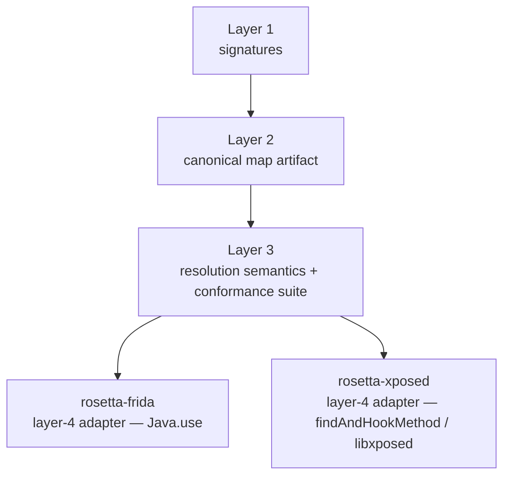
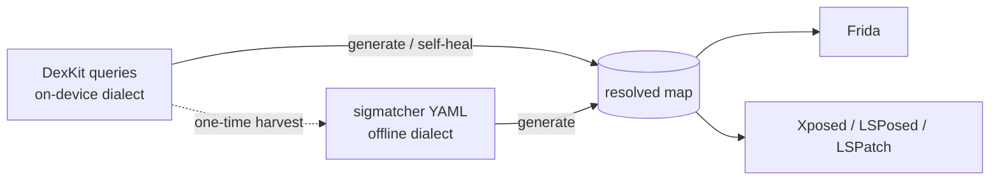

# RFC 0001 — Unified cross-framework signatures

| | |
|---|---|
| **Status** | Proposed |
| **Scope** | Architecture only — no production code in this RFC |
| **Supersedes** | nothing (companion to [Design](../reference/design.md)) |
| **Branch** | `claude/rosetta-unified-signatures-8WKsz` |

## Summary

`rosetta-frida` is a complete, tested V1.0 Frida library: hook by **real**
class/method/field names; a per-`(app, version)` map resolves them to the
**obfuscated** names that exist at runtime. That machinery — map schema, Zod
validation, resolver, CLI, sigmatcher adapter, attach-time health check — already
exists and is framework-neutral except for the final `Java.use` binding.

This RFC records the architecture for taking Rosetta beyond Frida:

1. **Serve Xposed / LSPosed / LSPatch** alongside Frida, by promoting the already-
   neutral layers to an explicit shared core and adding a thin JVM-side adapter.
2. **Build a community knowledge base** where researchers contribute signatures
   that progressively uncover obfuscated names, consumable identically by Frida
   script authors and Xposed module authors.
3. **Unify at the *map artifact*, not at the signature** — keep the two signature
   dialects the ecosystem already uses (DexKit on-device, sigmatcher offline) and
   converge them on the resolved map. No new signature standard is invented.

The five decisions below were grounded in research of the live ecosystem
(WaEnhancer, InstaEclipse, Cpatcher, DexKit, libxposed) and confirmed with the
project owner.

## Problem & motivation

Large obfuscated Android apps rotate obfuscation every minor release. Class
anchors that work for `1.2.x` don't survive `1.3.x`; the method often keeps its
single-letter name while the **class** it lives on gets reassigned. V1.0 already
solves this *for Frida* by decoupling "what we want to hook" (real name) from "how
it's spelled today" (obfuscated name) via per-version maps.

Two things V1.0 does not yet do:

- **It only serves Frida.** The dominant obfuscation-resilient *modules* in the
  wild are Xposed/LSPosed modules (WaEnhancer for WhatsApp, InstaEclipse for
  Instagram). They face exactly the rotation pain Rosetta removes — but they run
  inside the app JVM, not as an injected Frida JS host, so they can't consume the
  Frida library.
- **Its maps ship in-repo.** The long-term value is a *public, community-
  contributed* knowledge base — an obfuscation-map "CVE database" — that a hook
  author can pull from for whatever version a user actually has installed.

This RFC addresses both without duplicating the V1.0 core.

## The four-layer decomposition

Rosetta already factors into four layers. Only the bottom one is Frida-specific.

| Layer | What it is | Where it lives today | Framework-specific? |
|---|---|---|---|
| 1. Signature authoring & matching | rules that identify a class/method across versions | sigmatcher + `tools/adapters/sigmatcher.ts` | No |
| 2. Canonical map artifact + schema | `(app, version) → {real→obf + JVM descriptor}` | `maps/*.json`, `src/validate/schema.ts` | No |
| 3. Resolution semantics | real + version → obf + overload | `src/resolver/`, `src/session/version-match.ts` | No (spec); TS-only impl |
| 4. Binding / runtime adapter | apply the resolved name to actually hook | `src/proxy/` (`Java.use`), `src/marker/` | **Yes (Frida)** |

The map is already framework-neutral: a descriptor like
`(Landroid/os/Bundle;Lbbbb;)V` is exactly what `Java.use`,
`XposedHelpers.findAndHookMethod`, and the modern libxposed API all consume. The
only thing that *can't* be shared is the runtime **engine**: Frida is a JS host
injected into the process; Xposed/LSPosed/LSPatch run **inside the app JVM** as a
Kotlin/Java module. And because **LSPatch repackages the same Xposed module**, all
three are one adapter, not three.

## Ecosystem evidence

WaEnhancer (WhatsApp), InstaEclipse (Instagram), and Cpatcher independently
converge on the same pattern — which both validates Rosetta's thesis and reveals
where the unification belongs:

- **DexKit runtime fingerprinting, never hardcoded names.** The fingerprint
  vocabulary observed across these modules: `usingStrings` /
  `usingStringsContains` / `EndsWith`, `returnType`, `paramTypes`, `paramCount`,
  modifiers, `addUsingNumber`, `addInvoke`, opcode sequences.
- **A resolved cache keyed by `getLongVersionCode()`** (plus `lastUpdateTime` and
  module version), persisted to SharedPreferences/JSON. InstaEclipse's entries are
  literally `class \0 method \0 JVM-descriptor` — i.e. **a private, per-device,
  code-baked Rosetta map, rediscovered on every new version.**
- **Nobody hashes the APK on-device.** `longVersionCode` + `lastUpdateTime` are
  the O(1) identity used for cache invalidation (e.g. WaEnhancer's
  `UnobfuscatorCache`, InstaEclipse's `DexKitCache` keyed by
  `getLongVersionCode()`).
- **Signatures live inline in code**, organized as a per-feature registry — the
  maintenance pain Rosetta removes by making signatures shared *data*.

Rosetta's edge: turn those private, per-device, code-baked caches into **shared,
data-formatted signatures + pre-computed maps** consumed identically by Frida and
Xposed — with **zero cold-scan cost** whenever a map already exists.

---

## Decision 1 — Neutral core + per-framework adapters

Promote layers 1–3 to an explicitly framework-neutral core:

- The **map schema** (`src/validate/schema.ts`).
- The **resolution spec**, expressed language-independently plus a **conformance
  suite** of golden maps → expected resolutions (seeded from `tests/fixtures`).
- The neutral **Node tooling** (`tools/adapters/`, CLI).

- `rosetta-frida` stays the Frida (layer-4) adapter.
- `rosetta-xposed` is a **new sibling** Kotlin/JVM adapter consuming identical
  maps (scoped here, not built this session).
- Two resolver implementations (TS + Kotlin) are kept honest by **one shared
  conformance suite**, not shared runtime code.
- **Anti-scope:** do not try to make Frida "drive" Xposed. The execution models
  genuinely differ; a JVM-side library is required, not a bridge.

## Decision 2 — JVM side: two backends behind one thin resolver

`rosetta-xposed` is a **thin resolver**, not a hook framework. It resolves
real → obf and returns a `Class` / `Method` / descriptor plus a **deferred-binding
helper**; the developer hooks with whatever API they already use — the modern
libxposed API *or* legacy `XposedHelpers`. This mirrors V1.0's "just makes
`Java.use` smarter" philosophy and maximizes adoption. It does **not** own the
hook call.

Behind the single real-name resolution API sit **two interchangeable backends**:

- **Static backend (default).** A pre-computed map exists for this `version_code`
  → O(1) lookup, no DexKit, no native `.so`, no scan. This is also the only thing
  the Frida side ever needs (no DexKit-in-JS).
- **Dynamic backend (fallback / self-healing).** No map for this version → run the
  DexKit-dialect signatures on-device, resolve, and **emit the result as a
  `rosetta-runtime-discovered` source** (the schema already supports this) → cache
  locally (SharedPreferences keyed by `version_code` + map-content version, à la
  WaEnhancer's `TABLE_VERSION`) and optionally contribute upstream. This is the
  "slowly uncover names from real users" loop, automated. DexKit is an **optional
  dependency** — static-only modules don't ship `libdexkit.so`.

**This is the project owner's explicit "benefit from both" goal.** An
Xposed/LSPosed/LSPatch developer gets the **static, sigmatcher-generated map** for
every version that has one *and* **DexKit self-healing** for brand-new versions
that don't — through the *same* thin resolver and the *same* map artifact.

**Phasing (confirmed):** the neutral core + static backend + map convergence ship
first; the on-device DexKit backend is *architected now, built in a later phase*.

**Deferred binding** (the dynamic-class-loading concern): name *resolution* is
always available (it's data), but the *hook* must wait until the declaring class
is loadable. For packed/hardened apps that load dex late, the helper captures the
real classloader (hook `DexClassLoader` / `ClassLoader.loadClass`, or use
libxposed's `onPackageReady().getClassLoader()`) and binds when the target
appears. Map metadata (`dex`, `kind`, `extends`, anchors) informs whether deferral
is needed.

## Decision 3 — App identity: `version_code` selects, signer-cert guards, `apk_sha256` is provenance only

Full APK SHA-256 is not O(1) and is unused on-device. Split identity by role:

- **`version_code` (`longVersionCode`)** — an O(1) `PackageManager` field; the
  **primary on-device map-selection key. Add it to the schema.** (Selection today
  keys on `versionName` strings, which can be reused or ambiguous — keep
  `versionName` as a human label.)
- **`signer_sha256` (optional)** — the signing-certificate SHA-256 via
  `GET_SIGNING_CERTIFICATES` → `signingInfo.apkContentsSigners`. Cheap (the cert is
  pre-parsed by the system, not a hash of the whole file) and meaningful: it pins
  *publisher authenticity* and detects repacks. Stable across versions, so it is
  an **authenticity guard, not a version key.** Frida reads the same via
  `Java.use('android.content.pm.PackageManager')`.
- **`apk_sha256` (existing)** — offline **provenance only**, computed once by the
  contributor when generating the map; **never recomputed on-device.**

## Decision 4 — Knowledge base: signatures are the source, maps are published artifacts, validation is layered

**Signatures are the source of truth.** This is FOSS-correct and is the key
technical lever: a resolved map is *reproducible* from its signatures + the APK,
which is what makes it *verifiable*. **Resolved maps are generated, published
artifacts** for the many consumers (especially Frida authors) who won't run a
matcher or supply an APK. Provenance rides on existing schema fields (`apk_sha256`,
anchors, `source`, `confidence`, `sources[]`) plus the new `version_code` /
`signer_sha256`.

Validation is layered and deliberately **does not host APKs in public CI**
(APKMirror/APKPure ToS forbid automated access; hosting copyrighted APKs is a
liability):

1. **CI structural checks (no APK, blocking).** Schema valid; descriptors parse;
   overloads distinct; anchors present; `version_code` set; cross-version
   class/method count-delta sanity; referenced types resolvable within the map.
   Reuses `src/validate/schema.ts`. This is the gate to land.
2. **Reproduction + signed attestation.** ≥ N independent contributors (or a
   trusted runner) reproduce the map from the signatures and sign "ran signatures
   S vs `version_code` V / cert H → map M." Only the *attestation* enters the repo
   — never the APK. (Off-the-shelf: reproducible-builds, SLSA, in-toto,
   Sigstore/Rekor.)
3. **Optional self-hosted trusted runner.** The "CI with APK," moved *off* public
   CI onto a legally-clean machine (FOSS apps, or a maintainer's device). Public
   CI only verifies attestation signatures.
4. **Device-side health-check as the correctness oracle (post-landing).** Reuses
   `src/session/health-check.ts` (plus a Kotlin twin): verify resolved
   classes/methods exist and AIDL descriptors match, running where the APK
   legitimately lives. Opt-in telemetry aggregates pass/fail into a "verified-on
   `version_code` V" signal; `confidence` is a gradient, not a binary.
5. **Reputation / web-of-trust.** High confidence requires multiple independent
   reproductions or a trusted-runner attestation; maintainers can revert.

Trust model in one line: **like a CVE DB — attest with provenance, CI checks
well-formedness, the device confirms correctness, reputation accrues over time.**

Knowledge-base repo name: recommend **`rosetta-maps`** (holds both signatures and
generated maps); `rosetta-stones` is the cuter alternative. Low-stakes; owner's
call.

## Decision 5 — No new signature standard: two dialects by execution context, harvested via a one-time converter

The deliberate non-decision: **do not invent a canonical unified signature IR.**
That is the "now there are N+1 standards" trap. Lean instead on the two formats
the ecosystem already uses, split by *execution context* — not by app, not by
framework:

- **DexKit queries** — the **on-device / runtime** dialect. Already what
  WaEnhancer / InstaEclipse / Cpatcher ship; the only thing that can run live on a
  device. This is the dynamic backend's self-healing input (Decision 2).
- **sigmatcher YAML** — the **offline / host** dialect. Human-readable
  regex-over-smali, multi-version, and it generates maps. This is the public,
  clear research view and the source-of-truth for the static backend (Decision 4).
- **The resolved map** — the **convergence + universal consumption artifact.**
  Both dialects produce it; Frida and all three Xposed-family runtimes consume it
  with zero engine. *This* is the unification — at the artifact, not the signature.

**Harvesting is a one-time-per-source DexKit → sigmatcher conversion, not a live
IR.** To bring existing module research (WaEnhancer's `Unobfuscator.java`,
InstaEclipse's `DexKitCache.java`) into the public repo, write a converter that
reads their DexKit fingerprints and emits readable sigmatcher signatures. It runs
on ingestion (or when a source's fingerprints change) — it is **not** a runtime
dependency and **not** a maintained dual-emit pipeline. The original DexKit
queries stay as the on-device self-healing form; the sigmatcher YAML is the
offline/readable form. No third format is created.

- **Anti-scope.** The full bidirectional unified signature IR (this branch's
  namesake ambition) is explicitly **deferred, possibly indefinitely.** The
  vocabulary gap (regex-over-text ↔ structured bytecode queries) is real, and the
  map already delivers the practical unification, so the IR earns its keep only if
  the one-time converter proves too lossy in practice.
- **Reuse note.** The existing `src/convert/` module is a **map-format** converter
  (jsonc / yaml / ts-module for `rosetta convert`) — *not* a signature converter,
  and not to be confused with `docs/maps/conversion.md`. The DexKit → sigmatcher
  harvester is new, separate tooling.

## Reuse map

What's already built and should be reused rather than rewritten:

- `src/validate/schema.ts` — the map schema; extend with `version_code` /
  `signer_sha256` (Decision 3) and validate in CI tier 1 (Decision 4).
- `src/session/health-check.ts` — the correctness oracle; gets a Kotlin twin for
  the Xposed adapter (Decision 4, tier 4).
- `src/session/version-match.ts` — version selection; gains `version_code`
  primary-key selection.
- `tools/adapters/` — the sigmatcher adapter and the neutral CLI; the conformance
  suite seeds from here and from `tests/fixtures`.
- `src/marker/` — the Frida embed precedent for shipping a map inside a bundle.
- `src/convert/` — map-format conversion only; **not** the new signature harvester.

## Open questions / future work

- **Unified signature IR** — per Decision 5 this is **decided as deferred
  (possibly never)**, not an open question. The near-term unification is the *map
  artifact* + the *one-time DexKit → sigmatcher harvester*. Revisit only if the
  harvester proves too lossy.
- **Native (JNI / ELF-symbol) mapping** — a different mapping shape (function
  pointers, demangled symbols, base offsets); still V3.
- **Remote map fetch + caching** keyed by `(app, version_code)`.
- **Conformance-suite file format** shared across the JS and Kotlin resolvers.

## References

- DexKit — <https://luckypray.org/DexKit>, <https://github.com/LuckyPray/DexKit>
- WaEnhancer — <https://github.com/Dev4Mod/WaEnhancer> (`Unobfuscator.java`,
  `UnobfuscatorCache.java`)
- InstaEclipse — <https://github.com/ReSo7200/InstaEclipse> (`DexKitCache.java`)
- Cpatcher — <https://github.com/Xposed-Modules-Repo/io.github.cpatcher>
- libxposed API + example — <https://github.com/libxposed/api>,
  <https://github.com/libxposed/example>
- LSPosed (modern Xposed API) — <https://github.com/LSPosed/LSPosed>
- Android `PackageInfo` / `GET_SIGNING_CERTIFICATES` + APK Signature Scheme v2 —
  <https://developer.android.com/reference/android/content/pm/PackageInfo>,
  <https://source.android.com/docs/security/features/apksigning/v2>
- Reproducible Builds — <https://reproducible-builds.org>
- SLSA — <https://slsa.dev> · in-toto — <https://in-toto.io> ·
  Sigstore — <https://www.sigstore.dev>

## See also

- [Design](../reference/design.md) — the V1.0 Frida architecture this RFC builds on.
